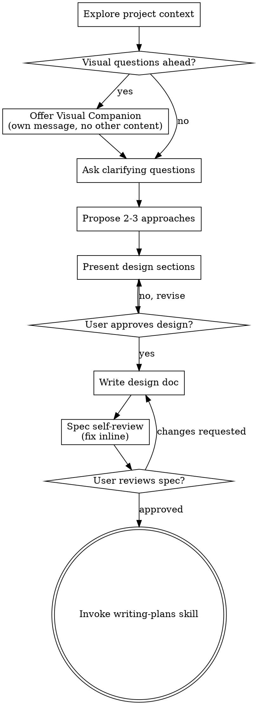

# Brainstorming Ideas Into Designs

Help turn ideas into fully formed designs and specs through natural collaborative dialogue.

Start by understanding the current project context, then ask questions one at a time to refine the idea. Once you understand what you're building, present the design and get user approval.

<HARD-GATE>
Do NOT invoke any implementation skill, write any code, scaffold any project, or take any implementation action until you have presented a design and the user has approved it. This applies to EVERY project regardless of perceived simplicity.
</HARD-GATE>

## Anti-Pattern: "This Is Too Simple To Need A Design"

Every project goes through this process. A todo list, a single-function utility, a config change — all of them. "Simple" projects are where unexamined assumptions cause the most wasted work. The design can be short (a few sentences for truly simple projects), but you MUST present it and get approval.

## Checklist

You MUST create a task for each of these items and complete them in order:

1. **Explore project context** — check files, docs, recent commits
2. **Offer visual companion** (if topic will involve visual questions) — this is its own message, not combined with a clarifying question. See the Visual Companion section below.
3. **Ask clarifying questions** — one at a time, understand purpose/constraints/success criteria
4. **Propose 2-3 approaches** — with trade-offs and your recommendation
5. **Present design** — in sections scaled to their complexity, get user approval after each section
6. **Write design doc** — save to `docs/superpowers/specs/YYYY-MM-DD-<topic>-design.md` and commit（**含 Loop Execution Contract · spec 级字段**，见下文）
7. **Spec self-review** — quick inline check for placeholders, contradictions, ambiguity, scope, **acceptance 可判定性** (see below)
8. **User reviews written spec** — ask user to review the spec file before proceeding
9. **Transition to implementation** — invoke **spec-driven-development** skill（writing-plans 继任）to create implementation plan

## Process Flow



**The terminal state is invoking spec-driven-development.** Do NOT invoke frontend-design, mcp-builder, or any other implementation skill. The ONLY skill you invoke after brainstorming is spec-driven-development.

## The Process

**Understanding the idea:**

- Check out the current project state first (files, docs, recent commits)
- Before asking detailed questions, assess scope: if the request describes multiple independent subsystems (e.g., "build a platform with chat, file storage, billing, and analytics"), flag this immediately. Don't spend questions refining details of a project that needs to be decomposed first.
- If the project is too large for a single spec, help the user decompose into sub-projects: what are the independent pieces, how do they relate, what order should they be built? Then brainstorm the first sub-project through the normal design flow. Each sub-project gets its own spec → plan → implementation cycle.
- For appropriately-scoped projects, ask questions one at a time to refine the idea
- Prefer multiple choice questions when possible, but open-ended is fine too
- Only one question per message - if a topic needs more exploration, break it into multiple questions
- Focus on understanding: purpose, constraints, success criteria

**Exploring approaches:**

- Propose 2-3 different approaches with trade-offs
- Present options conversationally with your recommendation and reasoning
- Lead with your recommended option and explain why

**Presenting the design:**

- Once you believe you understand what you're building, present the design
- Scale each section to its complexity: a few sentences if straightforward, up to 200-300 words if nuanced
- Ask after each section whether it looks right so far
- Cover: architecture, components, data flow, error handling, testing
- **Cover: Loop Execution Contract（spec 级）** — Goal、Acceptance Contract、Non-goals、Stop Escalation（详见 `skills/shared/references/loop-execution-contract.md`）
- Be ready to go back and clarify if something doesn't make sense

**Design for isolation and clarity:**

- Break the system into smaller units that each have one clear purpose, communicate through well-defined interfaces, and can be understood and tested independently
- For each unit, you should be able to answer: what does it do, how do you use it, and what does it depend on?
- Can someone understand what a unit does without reading its internals? Can you change the internals without breaking consumers? If not, the boundaries need work.
- Smaller, well-bounded units are also easier for you to work with - you reason better about code you can hold in context at once, and your edits are more reliable when files are focused. When a file grows large, that's often a signal that it's doing too much.

**Working in existing codebases:**

- Explore the current structure before proposing changes. Follow existing patterns.
- Where existing code has problems that affect the work (e.g., a file that's grown too large, unclear boundaries, tangled responsibilities), include targeted improvements as part of the design - the way a good developer improves code they're working in.
- Don't propose unrelated refactoring. Stay focused on what serves the current goal.

## After the Design

**Documentation:**

- Write the validated design (spec) to `docs/superpowers/specs/YYYY-MM-DD-<topic>-design.md`
  - (User preferences for spec location override this default)
- Use elements-of-style:writing-clearly-and-concisely skill if available
- Commit the design document to git

**Spec 必含章节（Loop Execution Contract · spec 级）**

> 单点真源：`skills/shared/references/loop-execution-contract.md` §2  
> **只写可判定性**；禁止复制 `loop` 的 G0–G9、自愈轮次、Goal→loop 降级链。

每个 design spec **必须**包含以下四节（简单项目可各 1–3 句，不可省略标题）：

```markdown
## Goal
[一句话可执行目标]

## Acceptance Contract
- [ ] [可观察、可判定的验收 1]
- [ ] [验收 2]

## Non-goals
- [本轮不做 …]

## Stop Escalation
- [何种未知/冲突出现时停止假设，回问或拆 spec]
```

**Acceptance 硬规则**：禁止「正常工作」「体验良好」；每条应能映射到未来 verification 命令或检查动作。

**Spec Self-Review:**
After writing the spec document, look at it with fresh eyes:

1. **Placeholder scan:** Any "TBD", "TODO", incomplete sections, or vague requirements? Fix them.
2. **Internal consistency:** Do any sections contradict each other? Does the architecture match the feature descriptions?
3. **Scope check:** Is this focused enough for a single implementation plan, or does it need decomposition?
4. **Ambiguity check:** Could any requirement be interpreted two different ways? If so, pick one and make it explicit.
5. **Acceptance contract:** Every acceptance item observable and pass/fail? Non-goals present? Stop Escalation lists real blockers? No gate-matrix copy-paste?

Fix any issues inline. No need to re-review — just fix and move on.

**User Review Gate:**
After the spec review loop passes, ask the user to review the written spec before proceeding:

> "Spec written and committed to `<path>`. Please review it and let me know if you want to make any changes before we start writing out the implementation plan."

Wait for the user's response. If they request changes, make them and re-run the spec review loop. Only proceed once the user approves.

**Implementation:**

- Invoke the **spec-driven-development** skill to create a detailed implementation plan（plan 须含 Verification / Termination / Escalation · 见共享契约 §3）
- Do NOT invoke any other skill. spec-driven-development is the next step.

## Key Principles

- **One question at a time** - Don't overwhelm with multiple questions
- **Multiple choice preferred** - Easier to answer than open-ended when possible
- **YAGNI ruthlessly** - Remove unnecessary features from all designs
- **Explore alternatives** - Always propose 2-3 approaches before settling
- **Incremental validation** - Present design, get approval before moving on
- **Be flexible** - Go back and clarify when something doesn't make sense

## Visual Companion

A browser-based companion for showing mockups, diagrams, and visual options during brainstorming. Available as a tool — not a mode. Accepting the companion means it's available for questions that benefit from visual treatment; it does NOT mean every question goes through the browser.

**Offering the companion:** When you anticipate that upcoming questions will involve visual content (mockups, layouts, diagrams), offer it once for consent:
> "Some of what we're working on might be easier to explain if I can show it to you in a web browser. I can put together mockups, diagrams, comparisons, and other visuals as we go. This feature is still new and can be token-intensive. Want to try it? (Requires opening a local URL)"

**This offer MUST be its own message.** Do not combine it with clarifying questions, context summaries, or any other content. The message should contain ONLY the offer above and nothing else. Wait for the user's response before continuing. If they decline, proceed with text-only brainstorming.

**Per-question decision:** Even after the user accepts, decide FOR EACH QUESTION whether to use the browser or the terminal. The test: **would the user understand this better by seeing it than reading it?**

- **Use the browser** for content that IS visual — mockups, wireframes, layout comparisons, architecture diagrams, side-by-side visual designs
- **Use the terminal** for content that is text — requirements questions, conceptual choices, tradeoff lists, A/B/C/D text options, scope decisions

A question about a UI topic is not automatically a visual question. "What does personality mean in this context?" is a conceptual question — use the terminal. "Which wizard layout works better?" is a visual question — use the browser.

If they agree to the companion, read the detailed guide before proceeding:
`skills/brainstorming/visual-companion.md`

---

## 论源（v1.0.4 工程实践红线对接）

本技能作为以下工程实践红线的**方法论支撑**（单点真源引用，AGENTS.md §9）：

- **R1.1 反选项清单** — 提供"≥ 2 个被否决备选 + 否决理由"的方法论框架
- **R1.2 机会成本可见** — 提供 trade-off 透明化的对话结构（"放弃了什么换取什么"）
- **R5.3 Tracer Bullet** — 提供 walking skeleton（端到端最小骨架）的具体技术路径
- **R5.7 Spike & Iterate** — 提供 spike-first 探索流程（不确定时先 spike 再实现）

> **红线触发场景**：任何 AI 推荐方案 / 设计新功能 / 探索未知问题时，必须遵循 R1.1/R1.2 + R5.3/R5.7；本技能提供方法论落地路径。
> **同步版本**：AGENTS.md v1.0.4（2026-07-03）

---

## §N. 小步快跑原则（v2.0 强化 · 吸收 v1.0.4 §9 R5.1/R5.3）

### KISS 红线（吸收 R5.1）
- 禁止为"优雅 / 通用 / 扩展性"增加不必要的抽象层 / 装饰器 / 元编程
- 新增 ≥5 行代码前先问：能不能不写？能不能复用现有？

### Tracer Bullet 红线（吸收 R5.3）
- 新功能先打通**端到端骨架**（walking skeleton）· 再补血肉
- 禁止"完整设计 + 完整实现"一气呵成
- 骨架 = 最小可运行的垂直切片（入口→处理→出口）

### 与 brainstorming 流程的关系
- 小步快跑是 brainstorming 的**实施约束**
- brainstorming 探索"做什么" · 小步快跑约束"怎么做到最小"
- 两者协同：先想清楚再最小化实施

### 反模式（禁止）
- 过度设计：为未来可能用到的功能提前抽象
- 完美主义：一次实施到位（应该先 work 再优化）
- 复制粘贴：不复用现有代码（违反 DRY）
