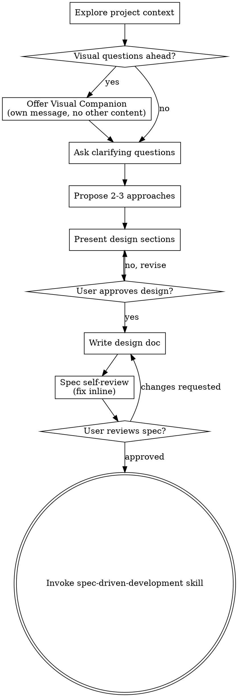

# Brainstorming：把想法变成设计

通过自然的协作对话，帮助把想法变成成形的设计与 spec。

先理解当前项目上下文，再逐个提问打磨想法。理解了要构建什么之后，呈现设计并取得用户批准。

<HARD-GATE>
在呈现设计并获得用户批准之前，禁止调用任何实现类技能、写任何代码、脚手架任何项目、采取任何实现动作。这适用于每一个项目，无论它看起来多简单。
</HARD-GATE>

## 反模式："这太简单了不需要设计"

每个项目都走这个流程。待办清单、单函数工具、配置改动——全都算。"简单"的项目恰恰是未经检验的假设浪费最多工作的地方。设计可以很短（真正简单的项目几句话即可），但必须呈现并取得批准。

## 仪式分级（2026-09-20 引入 · 源自 superpowers v6.3.0）

并非所有任务都值得全套双文档仪式。开工前先分级——**但每条路径都在实现前停下等用户批准**（分级省的是文档，不是审批门）：

| 级别 | 判定 | 产出 | 审批门 |
|---|---|---|---|
| **Spike**（≤4h 试验） | 结果不确定、以回答一个问题为目的 | 无设计文档；一段结论（答了什么/下一步） | 口头批准即可开工；结论仍需过目 |
| **Bounded**（边界清晰） | 单模块、无跨模块契约、可逆 | 单文档：spec 四节（Goal/Acceptance/Non-goals/Stop Escalation）各 1-3 句 | 呈现 spec 批准后实现 |
| **Architectural**（架构级） | 跨模块 / 不可逆 / 多方契约 / >1 天 | 全套：设计文档 + spec 四节 + 反选项清单（R1.1）+ grilling 触发评估 | 分节呈现、逐节批准 + User Review Gate |

**分级判定错误的自愈**：spike 过程发现超出 4h 或牵出跨模块契约 → 停下，升到 bounded/architectural 重走对应仪式。宁可升级不可硬闯。

**与审讯门的绑定（2026-09-20 边界审查补）**：凡产出 spec 四节的级别（bounded / architectural），**均须过下方清单第 7 步**（spec 自审 + grilling 触发评估）——分级省的是文档，不是质量闸门；仅 spike（无 spec、无审讯对象）免。

## 清单

必须为以下每一项创建任务并按序完成：

1. **探索项目上下文** —— 查文件、文档、最近 commit
2. **提供可视化伴侣**（若主题涉及视觉问题）—— 单独一条消息，不与澄清问题合并。见下文 Visual Companion 节。
3. **提澄清问题** —— 一次一个，理解目的/约束/成功标准
4. **提出 2-3 个方案** —— 带 trade-off 与你的推荐
5. **呈现设计** —— 按复杂度伸缩的分节呈现，每节后取得用户认可
6. **写设计文档** —— 保存至 `docs/superpowers/specs/YYYY-MM-DD-<topic>-design.md` 并 commit（**含 Loop Execution Contract · spec 级字段**，见下文）
7. **Spec 自审** —— 快速内联检查占位符、矛盾、歧义、范围、**acceptance 可判定性**（见下文）；**若满足下文「对抗审讯触发条件」任一条，先触发 grilling 审讯、修订写回后再进第 8 步**
8. **用户审阅书面 spec** —— 请用户在继续前审阅 spec 文件
9. **转入实现** —— 调用 **spec-driven-development** 技能（writing-plans 继任）创建实施计划

## 流程图


```dot
digraph brainstorming {
    "Explore project context" [shape=box];
    "Visual questions ahead?" [shape=diamond];
    "Offer Visual Companion\n(own message, no other content)" [shape=box];
    "Ask clarifying questions" [shape=box];
    "Propose 2-3 approaches" [shape=box];
    "Present design sections" [shape=box];
    "User approves design?" [shape=diamond];
    "Write design doc" [shape=box];
    "Spec self-review\n(fix inline)" [shape=box];
    "User reviews spec?" [shape=diamond];
    "Invoke spec-driven-development skill" [shape=doublecircle];

    "Explore project context" -> "Visual questions ahead?";
    "Visual questions ahead?" -> "Offer Visual Companion\n(own message, no other content)" [label="yes"];
    "Visual questions ahead?" -> "Ask clarifying questions" [label="no"];
    "Offer Visual Companion\n(own message, no other content)" -> "Ask clarifying questions";
    "Ask clarifying questions" -> "Propose 2-3 approaches";
    "Propose 2-3 approaches" -> "Present design sections";
    "Present design sections" -> "User approves design?";
    "User approves design?" -> "Present design sections" [label="no, revise"];
    "User approves design?" -> "Write design doc" [label="yes"];
    "Write design doc" -> "Spec self-review\n(fix inline)";
    "Spec self-review\n(fix inline)" -> "User reviews spec?";
    "User reviews spec?" -> "Write design doc" [label="changes requested"];
    "User reviews spec?" -> "Invoke spec-driven-development skill" [label="approved"];
}
```

**终态是调用 spec-driven-development。** 禁止调用 frontend-design、mcp-builder 或任何其他实现类技能。brainstorming 之后唯一调用的技能是 spec-driven-development。

## 流程

**理解想法：**

- 先看当前项目状态（文件、文档、最近 commit）
- 提详细问题之前先评估范围：若请求描述了多个独立子系统（如"建一个带聊天、文件存储、计费和分析的平台"），立即标记。不要把提问浪费在需要先分解的项目细节上。
- 若项目大到单个 spec 装不下，帮用户分解为子项目：独立部分是什么、如何关联、按什么顺序建？然后对第一个子项目走正常设计流程。每个子项目有自己的 spec → plan → 实现循环。
- 范围合适的项目，一次一个问题地打磨想法
- 尽量用选择题，开放式也可以
- 每条消息只问一个问题——一个主题需要深挖就拆成多个问题
- 聚焦理解：目的、约束、成功标准

**探索方案：**

- 提出 2-3 个不同方案及其 trade-off
- 以对话方式呈现选项，附你的推荐与理由
- 推荐项先行并解释为什么

**呈现设计：**

- 确认理解了要构建什么后，呈现设计
- 每节按复杂度伸缩：简单几句话，微妙处最多 200-300 字
- 每节后询问目前是否没问题
- 覆盖：架构、组件、数据流、错误处理、测试
- **覆盖：Loop Execution Contract（spec 级）** —— Goal、Acceptance Contract、Non-goals、Stop Escalation（详见 `skills/shared/references/loop-execution-contract.md`）
- 有地方讲不通就回去澄清

**为隔离与清晰而设计：**

- 把系统拆成较小单元：每个单元一个明确目的、通过定义良好的接口通信、可独立理解与测试
- 每个单元应能回答：它做什么、怎么用、依赖什么？
- 别人不读内部实现能理解单元做什么吗？改内部实现不会破坏使用方吗？不能，边界就有问题。
- 较小、边界清晰的单元也更利于你工作——你对能整个装进上下文的代码推理最好，对聚焦文件的编辑更可靠。文件变大往往说明它承担太多。

**在既有代码库中工作：**

- 提改动前先探索现有结构，遵循既有模式
- 既有代码的问题影响到当前工作（如文件过大、边界不清、职责纠缠）时，把针对性改进纳入设计——像好开发者改进自己工作区代码那样
- 不提无关重构。聚焦服务于当前目标。

## 设计之后

**文档：**

- 把验证过的设计（spec）写入 `docs/superpowers/specs/YYYY-MM-DD-<topic>-design.md`
  - （用户的 spec 位置偏好覆盖此默认）
- commit 设计文档到 git

**Spec 必含章节（Loop Execution Contract · spec 级）**

> 单点真源：`skills/shared/references/loop-execution-contract.md` §2
> **只写可判定性**；禁止复制 `loop` 的 G0–G9、自愈轮次、Goal→loop 降级链。

每个 design spec **必须**包含以下四节（简单项目可各 1–3 句，不可省略标题）：

```markdown
## Goal
[一句话可执行目标]

## Acceptance Contract
- [ ] [可观察、可判定的验收 1]
- [ ] [验收 2]

## Non-goals
- [本轮不做 …]

## Stop Escalation
- [何种未知/冲突出现时停止假设，回问或拆 spec]
```

**Acceptance 硬规则**：禁止「正常工作」「体验良好」；每条应能映射到未来 verification 命令或检查动作。

**Spec 自审：**
写完 spec 文档后，以新鲜视角复查：

1. **占位符扫描：** 有 "TBD"、"TODO"、未完成小节或含糊要求吗？修掉。
2. **内部一致性：** 各节相互矛盾吗？架构与功能描述匹配吗？
3. **范围检查：** 聚焦到单个实施计划装得下吗，还是需要分解？
4. **歧义检查：** 任何要求可能被解读成两种意思吗？选定一种并写明确。
5. **Acceptance contract：** 每条验收可观察、可判 pass/fail？Non-goals 在？Stop Escalation 列的是真实阻塞点？没有 gate-matrix 复制粘贴？

发现问题就地修。不必重审——修完继续。

**对抗审讯（条件触发 · grilling）：**

触发条件（满足**任一**即必须触发 grilling 审讯，不得跳过）：

1. spec 引入 **≥ 3 个**项目/领域中尚无明确定义的新领域术语
2. spec 涉及**跨模块或多方接口契约**（触及 ≥ 2 个模块边界，或新增/修改对外 API）
3. 预估实现工作量 **> 1 天**，或含不可逆决策（数据模型变更 / 外部契约 / 删除性操作）

三条全不满足 → 跳过本步，直接进入 User Review Gate。触发时调用 **grilling** 技能对 spec 做穷尽式审讯（frontier 决策树 + AskUserQuestion 轮次；术语沉淀并行走 domain-modeling），修订写回本文件后再进入 User Review Gate。

**User Review Gate：**
spec 评审循环通过后，请用户审阅书面 spec 再继续：

> "Spec 已写入并 commit 到 `<path>`。开始写实施计划之前，请审阅并告知是否需要修改。"

等待用户回应。要求修改则改完重跑 spec 评审循环。用户批准后才继续。

**实现：**

- 调用 **spec-driven-development** 技能创建详细实施计划（plan 须含 Verification / Termination / Escalation · 见共享契约 §3）
- 不调用任何其他技能。spec-driven-development 是下一步。

## 关键原则

- **一次一个问题** —— 不用多个问题轰炸用户
- **优先选择题** —— 可能时比开放式更易回答
- **YAGNI 无情** —— 从所有设计中删掉不必要的功能
- **探索备选** —— 敲定前永远提出 2-3 个方案
- **增量验证** —— 呈现设计，逐段取得批准再前进
- **保持灵活** —— 讲不通就回头澄清

## Visual Companion（可视化伴侣）

brainstorming 期间展示 mockup、图表与视觉选项的浏览器伴侣。它是一个工具——不是一种模式。接受伴侣意味着视觉类问题可以用它；**不**意味着每个问题都走浏览器。

**提供伴侣：** 预感接下来会有视觉内容（mockup、布局、图表）时，征求一次同意：
> "我们接下来的一些内容，如果能直接在浏览器里展示给你看，可能更容易讲清楚。我可以边聊边做 mockup、图表、对比等可视化。这个功能还比较新、可能比较费 token。要试试吗？（需要打开一个本地 URL）"

**这条提议必须单独成一条消息。** 不与澄清问题、上下文小结或任何其他内容合并。消息只含上述提议，别无其他。等用户回应再继续。若拒绝，纯文字头脑风暴。

**逐问题决策：** 用户接受后，每个问题仍单独决定用浏览器还是终端。判断标准：**这个问题看图比读字更容易懂吗？**

- **用浏览器**：内容本身是视觉的 —— mockup、线框、布局对比、架构图、并排视觉方案
- **用终端**：内容本身是文字的 —— 需求问题、概念选择、trade-off 清单、A/B/C/D 文字选项、范围决策

UI 主题的问题不自动等于视觉问题。"这个语境里'个性化'指什么？"是概念问题——用终端。"哪种向导布局更好？"是视觉问题——用浏览器。

用户同意使用伴侣后，先读详细指南再继续：
`skills/brainstorming/visual-companion.md`

---

## 论源（v1.0.4 工程实践红线对接）

本技能作为以下工程实践红线的**方法论支撑**（单点真源引用，AGENTS.md §9）：

- **R1.1 反选项清单** — 提供"≥ 2 个被否决备选 + 否决理由"的方法论框架
- **R1.2 机会成本可见** — 提供 trade-off 透明化的对话结构（"放弃了什么换取什么"）
- **R5.3 Tracer Bullet** — 提供 walking skeleton（端到端最小骨架）的具体技术路径
- **R5.7 Spike & Iterate** — 提供 spike-first 探索流程（不确定时先 spike 再实现）

> **红线触发场景**：任何 AI 推荐方案 / 设计新功能 / 探索未知问题时，必须遵循 R1.1/R1.2 + R5.3/R5.7；本技能提供方法论落地路径。
> **同步版本**：AGENTS.md v1.0.4（2026-07-03）

---

## §N. 小步快跑原则（v2.0 强化 · 吸收 v1.0.4 §9 R5.1/R5.3）

### KISS 红线（吸收 R5.1）
- 禁止为"优雅 / 通用 / 扩展性"增加不必要的抽象层 / 装饰器 / 元编程
- 新增 ≥5 行代码前先问：能不能不写？能不能复用现有？

### Tracer Bullet 红线（吸收 R5.3）
- 新功能先打通**端到端骨架**（walking skeleton）· 再补血肉
- 禁止"完整设计 + 完整实现"一气呵成
- 骨架 = 最小可运行的垂直切片（入口→处理→出口）

### 与 brainstorming 流程的关系
- 小步快跑是 brainstorming 的**实施约束**
- brainstorming 探索"做什么" · 小步快跑约束"怎么做到最小"
- 两者协同：先想清楚再最小化实施

### 反模式（禁止）
- 过度设计：为未来可能用到的功能提前抽象
- 完美主义：一次实施到位（应该先 work 再优化）
- 复制粘贴：不复用现有代码（违反 DRY）
