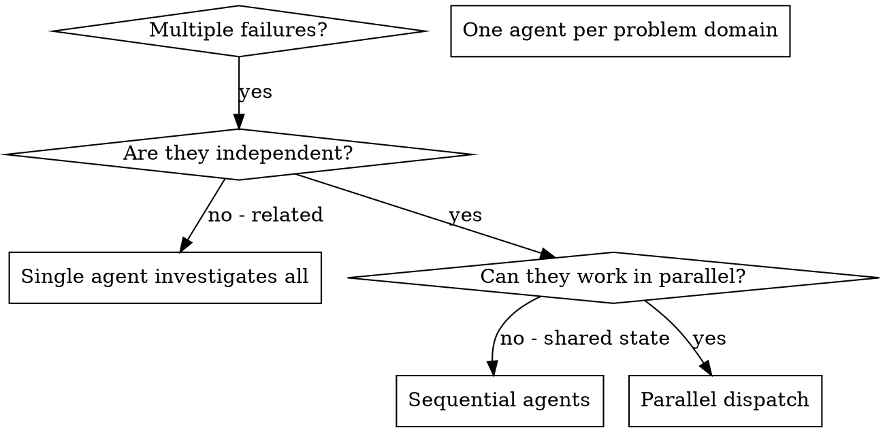

# Dispatching Parallel Agents（并行 agent 派遣）

## 概述

你把任务委派给上下文隔离的专职 agent。通过精确构造它们的指令与上下文，确保它们聚焦并完成任务。它们绝不继承你的会话上下文或历史——你构造的正是它们所需的。这同时也为你自己的上下文留出协调工作的空间。

当你面对多个互不相关的失败（不同测试文件、不同子系统、不同 bug）时，串行排查浪费时间。每个排查相互独立，可以并行。

**核心原则：** 每个独立问题域派一个 agent，让它们并发工作。

## 何时使用



**适用：**
- 3+ 个测试文件失败且根因各不相同
- 多个子系统独立损坏
- 每个问题无需其他问题的上下文即可理解
- 排查之间无共享状态

**不适用：**
- 失败相关（修一个可能连带修好其他）
- 需要理解全系统状态
- agent 之间会互相干扰

## 模式

### 1. 识别独立问题域

按"什么坏了"分组：
- 文件 A 测试：工具审批流程
- 文件 B 测试：批处理完成行为
- 文件 C 测试：中止功能

每个域独立——修工具审批不影响中止测试。

### 2. 构造聚焦的 agent 任务

每个 agent 获得（红线 7 五类输入）：
- **specific scope：** 一个测试文件或子系统
- **clear goal：** 让这些测试通过
- **constraints：** 不改其他代码
- **output format：** 发现与修复的总结

### 3. 并行派遣

```typescript
// Claude Code / AI 环境中
Task("Fix agent-tool-abort.test.ts failures")
Task("Fix batch-completion-behavior.test.ts failures")
Task("Fix tool-approval-race-conditions.test.ts failures")
// 三个并发运行
```

### 4. 评审与集成

agent 返回后：
- 逐个读总结
- 验证修复互不冲突
- 跑全量测试套件
- 集成全部改动

## Agent Prompt 结构

好的 agent prompt：
1. **聚焦** —— 一个清晰的问题域
2. **自含** —— 理解问题所需的全部上下文
3. **输出明确** —— agent 应返回什么？

```markdown
修复 src/agents/agent-tool-abort.test.ts 中的 3 个失败测试：

1. "should abort tool with partial output capture" —— 期望 message 含 'interrupted at'
2. "should handle mixed completed and aborted tools" —— 快工具被中止而非完成
3. "should properly track pendingToolCount" —— 期望 3 个结果但得到 0

这些是时序/竞态问题。你的任务：

1. 读测试文件，理解每个测试验证什么
2. 定位根因 —— 时序问题还是真实 bug？
3. 修复方式：
   - 用基于事件的等待替换任意超时
   - 若发现中止实现的真实 bug 则修复
   - 若测试断言的行为已变更则调整测试期望

禁止只加大超时 —— 找到真正的问题。

返回：你发现了什么、修了什么的总结。
```

## 常见错误

**❌ 太宽泛：** "把测试全修了" —— agent 迷失
**✅ 具体：** "修 agent-tool-abort.test.ts" —— 范围聚焦

**❌ 无上下文：** "修那个竞态" —— agent 不知道在哪
**✅ 有上下文：** 粘贴报错信息与测试名

**❌ 无约束：** agent 可能把所有东西都重构一遍
**✅ 有约束：** "禁止改生产代码" 或 "只修测试"

**❌ 输出模糊：** "修好它" —— 你不知道改了什么
**✅ 输出具体：** "返回根因与改动的总结"

## 何时不用

**失败相关：** 修一个可能连带修好其他 —— 先一起排查
**需全量上下文：** 理解问题需要看到整个系统
**探索性调试：** 还不知道什么坏了
**共享状态：** agent 会互相干扰（改同一批文件、用同一批资源）

## 真实会话示例

**场景：** 大重构后 3 个文件共 6 个测试失败

**失败分布：**
- agent-tool-abort.test.ts：3 个失败（时序问题）
- batch-completion-behavior.test.ts：2 个失败（工具未执行）
- tool-approval-race-conditions.test.ts：1 个失败（执行计数 = 0）

**决策：** 独立问题域——中止逻辑、批处理完成、审批竞态互不相干

**派遣：**
```
Agent 1 → 修 agent-tool-abort.test.ts
Agent 2 → 修 batch-completion-behavior.test.ts
Agent 3 → 修 tool-approval-race-conditions.test.ts
```

**结果：**
- Agent 1：用基于事件的等待替换了超时
- Agent 2：修了事件结构 bug（threadId 放错位置）
- Agent 3：加了异步工具执行完成等待

**集成：** 全部修复相互独立，零冲突，全量套件绿

**节省：** 3 个问题并行解决，而非串行

## 关键收益

1. **并行化** —— 多个排查同时进行
2. **聚焦** —— 每个 agent 范围窄，需跟踪的上下文少
3. **独立性** —— agent 互不干扰
4. **速度** —— 3 个问题在 1 个时间内解决

## 验证

agent 返回后：
1. **逐个评审总结** —— 理解改了什么
2. **查冲突** —— agent 是否改了同一处代码？
3. **跑全量套件** —— 验证所有修复协同工作
4. **抽查** —— agent 可能犯系统性错误

## 真实成效

来自调试会话（2025-10-03）：
- 3 个文件 6 个失败
- 3 个 agent 并行派遣
- 全部排查并发完成
- 全部修复成功集成
- agent 改动之间零冲突
