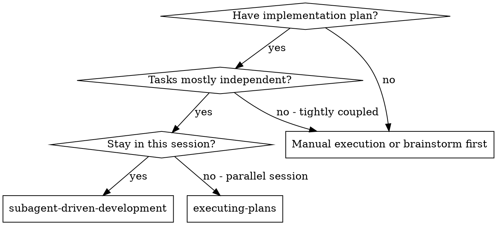
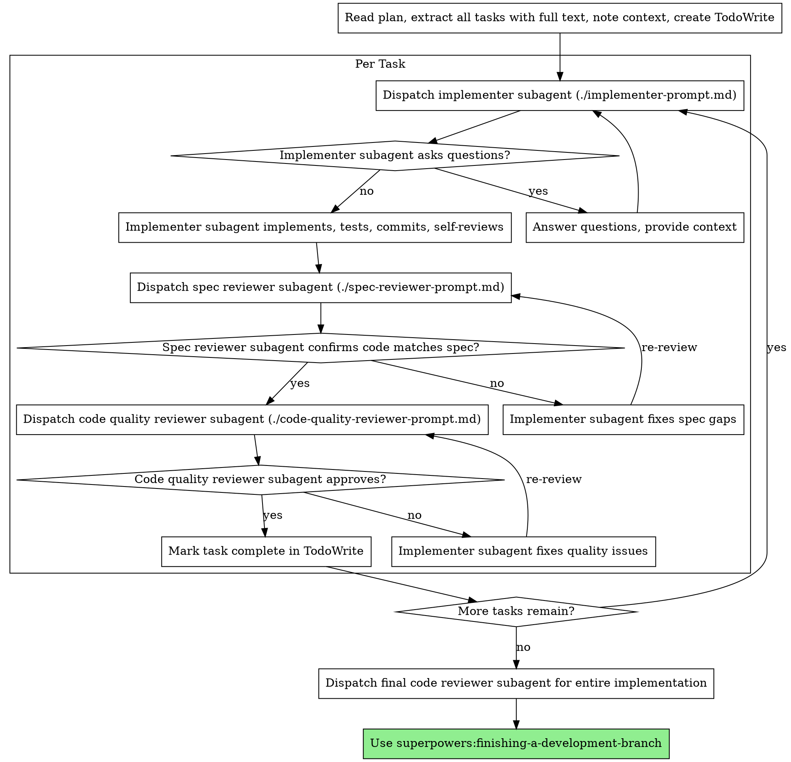

# Subagent-Driven Development

Execute plan by dispatching fresh subagent per task, with two-stage review after each: spec compliance review first, then code quality review.

**Why subagents:** You delegate tasks to specialized agents with isolated context. By precisely crafting their instructions and context, you ensure they stay focused and succeed at their task. They should never inherit your session's context or history — you construct exactly what they need. This also preserves your own context for coordination work.

**Core principle:** Fresh subagent per task + two-stage review (spec then quality) = high quality, fast iteration

**Continuous execution:** Do not pause to check in with your human partner between tasks. Execute all tasks from the plan without stopping. The only reasons to stop are: BLOCKED status you cannot resolve, ambiguity that genuinely prevents progress, or all tasks complete. "Should I continue?" prompts and progress summaries waste their time — they asked you to execute the plan, so execute it.

## When to Use



**vs. Executing Plans (parallel session):**
- Same session (no context switch)
- Fresh subagent per task (no context pollution)
- Two-stage review after each task: spec compliance first, then code quality
- Faster iteration (no human-in-loop between tasks)

## The Process



## Model Selection

Use the least powerful model that can handle each role to conserve cost and increase speed.

**Mechanical implementation tasks** (isolated functions, clear specs, 1-2 files): use a fast, cheap model. Most implementation tasks are mechanical when the plan is well-specified.

**Integration and judgment tasks** (multi-file coordination, pattern matching, debugging): use a standard model.

**Architecture, design, and review tasks**: use the most capable available model.

**Task complexity signals:**
- Touches 1-2 files with a complete spec → cheap model
- Touches multiple files with integration concerns → standard model
- Requires design judgment or broad codebase understanding → most capable model

## Handling Implementer Status

Implementer subagents report one of four statuses. Handle each appropriately:

**DONE:** Proceed to spec compliance review.

**DONE_WITH_CONCERNS:** The implementer completed the work but flagged doubts. Read the concerns before proceeding. If the concerns are about correctness or scope, address them before review. If they're observations (e.g., "this file is getting large"), note them and proceed to review.

**NEEDS_CONTEXT:** The implementer needs information that wasn't provided. Provide the missing context and re-dispatch.

**BLOCKED:** The implementer cannot complete the task. Assess the blocker:
1. If it's a context problem, provide more context and re-dispatch with the same model
2. If the task requires more reasoning, re-dispatch with a more capable model
3. If the task is too large, break it into smaller pieces
4. If the plan itself is wrong, escalate to the human

**Never** ignore an escalation or force the same model to retry without changes. If the implementer said it's stuck, something needs to change.

## Prompt Templates

- `./implementer-prompt.md` - Dispatch implementer subagent
- `./spec-reviewer-prompt.md` - Dispatch spec compliance reviewer subagent
- `./code-quality-reviewer-prompt.md` - Dispatch code quality reviewer subagent

## Example Workflow

```
You: I'm using Subagent-Driven Development to execute this plan.

[Read plan file once: docs/superpowers/plans/feature-plan.md]
[Extract all 5 tasks with full text and context]
[Create TodoWrite with all tasks]

Task 1: Hook installation script

[Get Task 1 text and context (already extracted)]
[Dispatch implementation subagent with full task text + context]

Implementer: "Before I begin - should the hook be installed at user or system level?"

You: "User level (~/.config/superpowers/hooks/)"

Implementer: "Got it. Implementing now..."
[Later] Implementer:
  - Implemented install-hook command
  - Added tests, 5/5 passing
  - Self-review: Found I missed --force flag, added it
  - Committed

[Dispatch spec compliance reviewer]
Spec reviewer: ✅ Spec compliant - all requirements met, nothing extra

[Get git SHAs, dispatch code quality reviewer]
Code reviewer: Strengths: Good test coverage, clean. Issues: None. Approved.

[Mark Task 1 complete]

Task 2: Recovery modes

[Get Task 2 text and context (already extracted)]
[Dispatch implementation subagent with full task text + context]

Implementer: [No questions, proceeds]
Implementer:
  - Added verify/repair modes
  - 8/8 tests passing
  - Self-review: All good
  - Committed

[Dispatch spec compliance reviewer]
Spec reviewer: ❌ Issues:
  - Missing: Progress reporting (spec says "report every 100 items")
  - Extra: Added --json flag (not requested)

[Implementer fixes issues]
Implementer: Removed --json flag, added progress reporting

[Spec reviewer reviews again]
Spec reviewer: ✅ Spec compliant now

[Dispatch code quality reviewer]
Code reviewer: Strengths: Solid. Issues (Important): Magic number (100)

[Implementer fixes]
Implementer: Extracted PROGRESS_INTERVAL constant

[Code reviewer reviews again]
Code reviewer: ✅ Approved

[Mark Task 2 complete]

...

[After all tasks]
[Dispatch final code-reviewer]
Final reviewer: All requirements met, ready to merge

Done!
```

## Advantages

**vs. Manual execution:**
- Subagents follow TDD naturally
- Fresh context per task (no confusion)
- Parallel-safe (subagents don't interfere)
- Subagent can ask questions (before AND during work)

**vs. Executing Plans:**
- Same session (no handoff)
- Continuous progress (no waiting)
- Review checkpoints automatic

**Efficiency gains:**
- No file reading overhead (controller provides full text)
- Controller curates exactly what context is needed
- Subagent gets complete information upfront
- Questions surfaced before work begins (not after)

**Quality gates:**
- Self-review catches issues before handoff
- Two-stage review: spec compliance, then code quality
- Review loops ensure fixes actually work
- Spec compliance prevents over/under-building
- Code quality ensures implementation is well-built

**Cost:**
- More subagent invocations (implementer + 2 reviewers per task)
- Controller does more prep work (extracting all tasks upfront)
- Review loops add iterations
- But catches issues early (cheaper than debugging later)

## Red Flags

**Never:**
- Start implementation on main/master branch without explicit user consent
- Skip reviews (spec compliance OR code quality)
- Proceed with unfixed issues
- Dispatch multiple implementation subagents in parallel (conflicts)
- Make subagent read plan file (provide full text instead)
- Skip scene-setting context (subagent needs to understand where task fits)
- Ignore subagent questions (answer before letting them proceed)
- Accept "close enough" on spec compliance (spec reviewer found issues = not done)
- Skip review loops (reviewer found issues = implementer fixes = review again)
- Let implementer self-review replace actual review (both are needed)
- **Start code quality review before spec compliance is ✅** (wrong order)
- Move to next task while either review has open issues

**If subagent asks questions:**
- Answer clearly and completely
- Provide additional context if needed
- Don't rush them into implementation

**If reviewer finds issues:**
- Implementer (same subagent) fixes them
- Reviewer reviews again
- Repeat until approved
- Don't skip the re-review

**If subagent fails task:**
- Dispatch fix subagent with specific instructions
- Don't try to fix manually (context pollution)

## Integration

**Required workflow skills:**
- **superpowers:using-git-worktrees** - Ensures isolated workspace (creates one or verifies existing)
- **spec-driven-development** - Creates the plan this skill executes
- **superpowers:requesting-code-review** - Code review template for reviewer subagents
- **superpowers:finishing-a-development-branch** - Complete development after all tasks

**Subagents should use:**
- **superpowers:test-driven-development** - Subagents follow TDD for each task

**Alternative workflow:**
- **superpowers:executing-plans** - Use for parallel session instead of same-session execution

---

## 🆕 v6.1 增强：可桥接组件（Bridgeable Components · opt-in）

> **本节为 v6.1 新增内容，opt-in 启用。** 默认情况下，subagent-dd 仍按上述"任务循环 + 双阶段审查"模式独立运行；启用桥接时，go / loop 可通过 `bridges/contract.py` 调用 subagent-dd 的 6 个核心契约作为 G9/G10 的增强实现。

### 灰度开关

```bash
# 默认（不启用）
export LOOPENGINE_BRIDGES=disabled    # 默认值，不加载 bridges/

# 启用桥接（alpha）
export LOOPENGINE_BRIDGES=alpha       # 允许 go/loop 通过 bridges/contract.py 调用
```

### 6 个桥接契约

| 桥接函数 | 对应章节 | 用途 |
|---------|---------|------|
| `dispatch_implementer` | `Your Job`（implementer-prompt.md） | 派遣 implementer subagent，返回 4 状态枚举 |
| `dispatch_spec_reviewer` | `What Was Requested`（spec-reviewer-prompt.md） | 派遣 spec reviewer，返回 ✅/❌ + file:line |
| `dispatch_code_quality_reviewer` | `DESCRIPTION`（code-quality-reviewer-prompt.md） | 派遣 code quality reviewer，返回 3 层 Issues |
| `model_select` | `Model Selection` | 信号→模型档位映射 |
| `handle_implementer_status` | `Handling Implementer Status` | 4 状态应对动作状态机 |
| `review_gate` | `Red Flags` | 强顺序约束：spec ✅ → code quality |

### 与 go / loop 的集成

**go G10 桥接**（Step ⑦.5 系统审查）：
```bash
LOOPENGINE_BRIDGES=alpha /go --reviewer=subagent-dd 实现订单管理功能
  └─ G10 = bridges/dispatch_code_quality_reviewer 审查整特性分支
```

**loop G9 桥接**（commit 前代码审查）：
```bash
LOOPENGINE_BRIDGES=alpha /loop --reviewer=subagent-dd 实现分页功能
  └─ G9 = bridges 三阶段循环
       （implementer → spec → code quality）
```

### 详细规范

- 桥接组件总览 → `bridges/README.md`
- 6 个桥接函数契约 → `bridges/contract.py`
- 集成模式 + 失败降级 → `bridges/dispatcher.md`
- loop G9 启用示例 → `bridges/examples/loop-g9-with-bridge.md`

### 兼容性承诺

- ✅ **3 个 prompt template 不动**（implementer / spec-reviewer / code-quality-reviewer）
- ✅ **默认（disabled）行为 100% 不变**——任务循环 + 双阶段审查照常运行
- ✅ **桥接失败自动降级**到原 G9/G10，不报错中断
- ✅ v5.4 / v6.0 完全兼容

---

## §N. V3 Subagent 边界详规（吸收原 AGENTS.md §7.5 / §7.7 · v2.0 迁移）

> **来源**：原 AGENTS.md §7 Subagent 边界红线（v1.0.6+ · 909 行结构）。
> v2.0 AGENTS.md 精简为 V3 一句话铁律（"派 subagent 必须传 5 类输入；主 agent 不得仅转述，必须独立验证"），"4 不派发硬条件"和"已知边界表"作为补充规则迁入本节，与本 SKILL.md 既有的 "Red Flags Never 清单"（L245-260）互补——前者管"是否派"，后者管"派了之后怎么用"。
> 归档溯源：`docs/legacy/red-lines-history.md` §5.7。

### N.1 4 不派发硬条件（原 §7.5）

满足以下任一条件时**不得派发 subagent**（即使本 SKILL.md "The Process" 流程已就绪，也必须留在主 agent 单步执行）：

| # | 不派发条件 | 原因 | 替代做法 |
|---|-----------|------|---------|
| 1 | **问题之间共享状态**（需协调而非并行） | subagent 上下文隔离 → 状态不同步 → 互相覆盖 | 主 agent 串行处理，状态保留在同一上下文 |
| 2 | **需全 session 上下文** | subagent **never inherit session context**（本 SKILL.md L19 原则）→ 缺失历史 → 误判 | 主 agent 自己做，或先抽取足够上下文再派（成本可能高于自做） |
| 3 | **探索性调试**（结果不确定） | 结果不确定 → 单步更可控；subagent 走偏后主 agent 难以纠偏 | 主 agent 单步 systematic-debugging |
| 4 | **顺序依赖**（前一步输出决定后一步输入） | 前步未出后步无法启动 → 并行无意义 → 派了也是串行 | 主 agent 直接串行，避免 handoff 开销 |

**违规判定**：违反 4 不派发条件强行并行 = 🔴 红线违规（与"派发时不传 5 类输入"、"subagent 返回未经独立验证即宣称完成"同级）。

**与 Red Flags Never 清单（L245-260）的边界**：
- Red Flags 管**派发之后**的流程违规（跳过 review / 并行 implementer / 让 subagent 读 plan 文件 / 忽略 subagent 提问 等）
- 本节管**派发之前**的决策违规（不该派却派了）
- 两者叠加覆盖 subagent 生命周期的全部违规模式

### N.2 已知边界（v1.0.2 暂未实现 · 原 §7.7）

下列 4 项能力在原 AGENTS.md §7.7 已标注为"已知缺失"，v2.0 迁移时保留登记，作为本 SKILL.md 的"已知技术债"——不影响当前派发流程，但使用者应知道这些保护尚未到位：

| # | 缺失能力 | 影响 | 计划 |
|---|---------|------|------|
| 1 | **工具白名单**（subagent 工具权限收敛） | subagent 理论上可调用主 agent 全部工具，无强制权限隔离 | 后续 v6.x 桥接层完成（`bridges/contract.py` 已提供 opt-in 入口） |
| 2 | **token 预算**（限制 subagent 读大文件全量） | subagent 可能 Read 全量大文件 → 上下文爆炸 → quality 下降 | 待立项；当前靠 implementer-prompt.md 的 "context snippets" 约束 |
| 3 | **递归派发禁令**（subagent 再派 subagent） | 理论上 subagent 可再调 Agent 工具 → 递归失控 | 待立项；当前靠 prompt 显式禁止 |
| 4 | **commit 签名审计**（subagent ID 嵌入 commit） | subagent 提交的 commit 无法追溯是哪个派发轮次 | 待立项；当前靠 TodoWrite + handoff JSON 记录 |

> **使用建议**：已知边界 1/2 是"可能影响 quality"的软限制，使用本 skill 时**应**在 implementer-prompt.md 中显式声明"仅使用以下工具"和"单文件 ≤ N 行"；3/4 是"审计追溯"类限制，对生产代码 quality 无直接影响，但 PR review 时需人工补追溯信息。

> **与 V3 红线的协同**：本节是 V3 一句话铁律（"传 5 类输入 + 独立验证"）的**前置决策层**和**已知盲区登记**——5 类输入决定"怎么派"，4 不派发决定"是否派"，已知边界决定"派了之后还缺什么保护"。
