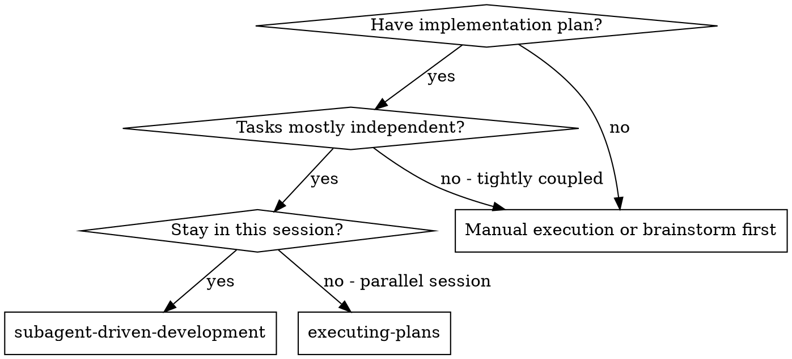
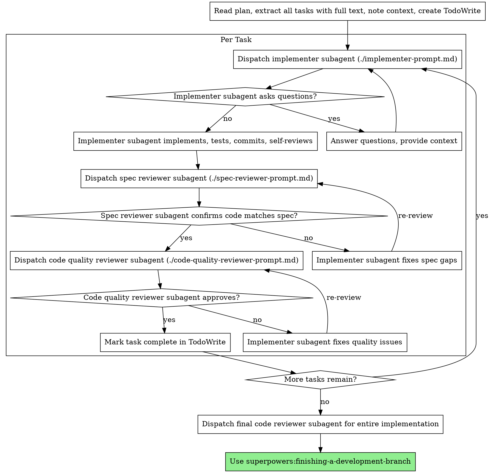

# Subagent-Driven Development（subagent 驱动开发）

按计划逐任务派遣全新 subagent 执行，每任务后两阶段评审：先 spec compliance（规格合规）评审，再 code quality（代码质量）评审。

**为什么用 subagent：** 你把任务委派给上下文隔离的专职 agent。通过精确构造它们的指令与上下文，确保它们聚焦并完成任务。它们绝不继承你的会话上下文或历史——你构造的正是它们所需的。这同时也为你自己的上下文留出协调工作的空间。

**核心原则：** 每任务全新 subagent + 两阶段评审（先 spec 后 quality）= 高质量、快迭代

**连续执行：** 任务之间不要停下来向 human partner 打卡。不间断执行计划中全部任务。仅以下情况停下：无法解决的 BLOCKED、真正阻碍推进的歧义、或全部任务完成。"要继续吗？"类提问和进度小结浪费他们的时间——他们让你执行计划，那就执行。

## 何时使用


```dot
digraph when_to_use {
    "Have implementation plan?" [shape=diamond];
    "Tasks mostly independent?" [shape=diamond];
    "Stay in this session?" [shape=diamond];
    "subagent-driven-development" [shape=box];
    "executing-plans" [shape=box];
    "Manual execution or brainstorm first" [shape=box];

    "Have implementation plan?" -> "Tasks mostly independent?" [label="yes"];
    "Have implementation plan?" -> "Manual execution or brainstorm first" [label="no"];
    "Tasks mostly independent?" -> "Stay in this session?" [label="yes"];
    "Tasks mostly independent?" -> "Manual execution or brainstorm first" [label="no - tightly coupled"];
    "Stay in this session?" -> "subagent-driven-development" [label="yes"];
    "Stay in this session?" -> "executing-plans" [label="no - parallel session"];
}
```

**vs. Executing Plans（并行会话执行）：**
- 同一会话（无上下文切换）
- 每任务全新 subagent（无上下文污染）
- 每任务后两阶段评审：先 spec 合规，后代码质量
- 迭代更快（任务间无人工介入）

## 流程


```dot
digraph process {
    rankdir=TB;

    subgraph cluster_per_task {
        label="Per Task";
        "Dispatch implementer subagent (./implementer-prompt.md)" [shape=box];
        "Implementer subagent asks questions?" [shape=diamond];
        "Answer questions, provide context" [shape=box];
        "Implementer subagent implements, tests, commits, self-reviews" [shape=box];
        "Dispatch spec reviewer subagent (./spec-reviewer-prompt.md)" [shape=box];
        "Spec reviewer subagent confirms code matches spec?" [shape=diamond];
        "Implementer subagent fixes spec gaps" [shape=box];
        "Dispatch code quality reviewer subagent (./code-quality-reviewer-prompt.md)" [shape=box];
        "Code quality reviewer subagent approves?" [shape=diamond];
        "Implementer subagent fixes quality issues" [shape=box];
        "Mark task complete in TodoWrite" [shape=box];
    }

    "Read plan, extract all tasks with full text, note context, create TodoWrite" [shape=box];
    "More tasks remain?" [shape=diamond];
    "Dispatch final code reviewer subagent for entire implementation" [shape=box];
    "Use superpowers:finishing-a-development-branch" [shape=box style=filled fillcolor=lightgreen];

    "Read plan, extract all tasks with full text, note context, create TodoWrite" -> "Dispatch implementer subagent (./implementer-prompt.md)";
    "Dispatch implementer subagent (./implementer-prompt.md)" -> "Implementer subagent asks questions?";
    "Implementer subagent asks questions?" -> "Answer questions, provide context" [label="yes"];
    "Answer questions, provide context" -> "Dispatch implementer subagent (./implementer-prompt.md)";
    "Implementer subagent asks questions?" -> "Implementer subagent implements, tests, commits, self-reviews" [label="no"];
    "Implementer subagent implements, tests, commits, self-reviews" -> "Dispatch spec reviewer subagent (./spec-reviewer-prompt.md)";
    "Dispatch spec reviewer subagent (./spec-reviewer-prompt.md)" -> "Spec reviewer subagent confirms code matches spec?";
    "Spec reviewer subagent confirms code matches spec?" -> "Implementer subagent fixes spec gaps" [label="no"];
    "Implementer subagent fixes spec gaps" -> "Dispatch spec reviewer subagent (./spec-reviewer-prompt.md)" [label="re-review"];
    "Spec reviewer subagent confirms code matches spec?" -> "Dispatch code quality reviewer subagent (./code-quality-reviewer-prompt.md)" [label="yes"];
    "Dispatch code quality reviewer subagent (./code-quality-reviewer-prompt.md)" -> "Code quality reviewer subagent approves?";
    "Code quality reviewer subagent approves?" -> "Implementer subagent fixes quality issues" [label="no"];
    "Implementer subagent fixes quality issues" -> "Dispatch code quality reviewer subagent (./code-quality-reviewer-prompt.md)" [label="re-review"];
    "Code quality reviewer subagent approves?" -> "Mark task complete in TodoWrite" [label="yes"];
    "Mark task complete in TodoWrite" -> "More tasks remain?";
    "More tasks remain?" -> "Dispatch implementer subagent (./implementer-prompt.md)" [label="yes"];
    "More tasks remain?" -> "Dispatch final code reviewer subagent for entire implementation" [label="no"];
    "Dispatch final code reviewer subagent for entire implementation" -> "Use superpowers:finishing-a-development-branch";
}
```

## Model Selection（模型选择）

用能胜任各角色的最弱模型，省成本提速度。

**机械实现任务**（隔离函数、清晰规格、1-2 文件）：用快而廉的模型。计划写得当时，大多数实现任务都是机械的。

**集成与判断任务**（多文件协调、模式匹配、调试）：用标准模型。

**架构、设计与评审任务**：用最强可用模型。

**任务复杂度信号：**
- 动 1-2 文件且规格完整 → 廉价模型
- 动多文件且有集成顾虑 → 标准模型
- 需要设计判断或广域代码库理解 → 最强模型

## 处理 implementer 状态

implementer subagent 回报四种状态之一，分别处理：

**DONE：** 进入 spec 合规评审。

**DONE_WITH_CONCERNS：** implementer 完成了工作但标注了疑虑。先读疑虑再继续。若关乎正确性或范围，先处理再评审。若只是观察（如"这个文件在变大"），记下并进入评审。

**NEEDS_CONTEXT：** implementer 缺少未提供的信息。补上缺失上下文后重新派遣。

**BLOCKED：** implementer 无法完成任务。评估阻塞点：
1. 上下文问题 → 提供更多上下文，同模型重派
2. 任务需要更强推理 → 换更强模型重派
3. 任务太大 → 拆小
4. 计划本身有错 → 上报人类

**绝不**无视升级请求或让同一模型无变化地重试。implementer 说卡住了，就一定有东西要变。

## Prompt 模板

- `./implementer-prompt.md` —— 派遣 implementer subagent
- `./spec-reviewer-prompt.md` —— 派遣 spec 合规 reviewer subagent
- `./code-quality-reviewer-prompt.md` —— 派遣 code quality reviewer subagent

## 示例工作流

```
你：我正在使用 Subagent-Driven Development 执行此计划。

[读计划文件一次：docs/superpowers/plans/feature-plan.md]
[提取全部 5 个任务的全文与上下文]
[创建含全部任务的 TodoWrite]

Task 1: Hook 安装脚本

[取 Task 1 全文与上下文（已提取）]
[派遣 implementer subagent，附任务全文 + 上下文]

implementer："开始前——hook 装在用户级还是系统级？"

你："用户级（~/.config/superpowers/hooks/）"

implementer："明白，开始实现…"
[稍后] implementer：
  - 实现了 install-hook 命令
  - 加了测试，5/5 通过
  - 自审：发现漏了 --force flag，已补
  - 已 commit

[派遣 spec 合规 reviewer]
spec reviewer：✅ 规格合规——所有要求满足，无多余

[取 git SHA，派遣 code quality reviewer]
quality reviewer：优点：测试覆盖好、干净。问题：无。批准。

[标记 Task 1 完成]

Task 2: 恢复模式

[取 Task 2 全文与上下文（已提取）]
[派遣 implementer subagent，附任务全文 + 上下文]

implementer：[无提问，直接开工]
implementer：
  - 加了 verify/repair 模式
  - 8/8 测试通过
  - 自审：无问题
  - 已 commit

[派遣 spec 合规 reviewer]
spec reviewer：❌ 问题：
  - 缺失：进度汇报（spec 要求"每 100 项汇报一次"）
  - 多余：加了 --json flag（未要求）

[implementer 修复问题]
implementer：移除 --json flag，补上进度汇报

[spec reviewer 复审]
spec reviewer：✅ 现在规格合规

[派遣 code quality reviewer]
quality reviewer：优点：扎实。问题（Important）：魔法数字（100）

[implementer 修复]
implementer：抽出 PROGRESS_INTERVAL 常量

[quality reviewer 复审]
quality reviewer：✅ 批准

[标记 Task 2 完成]

…

[全部任务后]
[派遣最终 code-reviewer]
最终 reviewer：所有要求满足，可合并

完成！
```

## 优势

**vs. 手动执行：**
- subagent 天然遵循 TDD
- 每任务全新上下文（无混淆）
- 并行安全（subagent 互不干扰）
- subagent 可提问（开工前与工作中都可）

**vs. Executing Plans：**
- 同一会话（无交接）
- 连续推进（无等待）
- 评审检查点自动化

**效率收益：**
- 无读文件开销（controller 提供全文）
- controller 精确筛选所需上下文
- subagent 一次性拿到完整信息
- 问题在开工前暴露（而非事后）

**质量闸门：**
- 自审在交接前拦截问题
- 两阶段评审：spec 合规 + 代码质量
- 评审循环确保修复真正生效
- spec 合规防过度/不足实现
- code quality 确保实现质量

**成本：**
- 更多 subagent 调用（每任务 implementer + 2 reviewer）
- controller 准备工作更多（前置提取全部任务）
- 评审循环增加迭代
- 但问题拦得早（比事后调试便宜）

## Red Flags

**Never：**
- 未经用户明确同意就在 main/master 分支上开工
- 跳过评审（spec 合规 OR 代码质量）
- 带未修复问题继续
- 并行派遣多个 implementer subagent（冲突）
- 从 subagent 内再派遣 subagent（递归派遣）——implementer/reviewer 必须自己做自己的活；嵌套派遣曾产生重复评审与失控成本（2026-09-20 引入，源自 superpowers v6.3.0）
- 让 subagent 自己读计划文件（直接提供全文）
- 跳过场景铺垫上下文（subagent 需理解任务所处位置）
- 无视 subagent 提问（先答再放行）
- spec 合规上接受"差不多"（spec reviewer 发现问题 = 没完成）
- 跳过评审循环（reviewer 发现问题 = implementer 修复 = 再评审）
- 让 implementer 自审替代正式评审（两者都需要）
- **spec 合规未 ✅ 就开始 code quality 评审**（顺序错误）
- 任一评审还有未决问题时进入下一任务

**subagent 提问时：**
- 清晰完整地回答
- 需要时补上下文
- 不催促其开工

**reviewer 发现问题时：**
- implementer（同一 subagent）修复
- reviewer 再评审
- 循环直到批准
- 不跳过复审

**subagent 任务失败时：**
- 派遣修复 subagent 并附具体指令
- 不亲手修（上下文污染）

## Integration（衔接）

**必需工作流技能：**
- **superpowers:using-git-worktrees** —— 确保隔离工作区（创建或验证）
- **spec-driven-development** —— 产出本技能执行的计划
- **superpowers:requesting-code-review** —— reviewer subagent 的代码评审模板
- **superpowers:finishing-a-development-branch** —— 全部任务后收尾

**subagent 应使用：**
- **superpowers:test-driven-development** —— subagent 每任务遵循 TDD

**替代工作流：**
- **superpowers:executing-plans** —— 并行会话执行时改用它

---

## 🆕 v6.1 增强：可桥接组件（Bridgeable Components · opt-in）

> **本节为 v6.1 新增内容，opt-in 启用。** 默认情况下，subagent-dd 仍按上述"任务循环 + 双阶段审查"模式独立运行；启用桥接时，go / loop 可通过 `bridges/contract.py` 调用 subagent-dd 的 6 个核心契约作为 G9/G10 的增强实现。

### 灰度开关

```bash
# 默认（不启用）
export LOOPENGINE_BRIDGES=disabled    # 默认值，不加载 bridges/

# 启用桥接（alpha）
export LOOPENGINE_BRIDGES=alpha       # 允许 go/loop 通过 bridges/contract.py 调用
```

### 6 个桥接契约

| 桥接函数 | 对应章节 | 用途 |
|---------|---------|------|
| `dispatch_implementer` | `Your Job`（implementer-prompt.md） | 派遣 implementer subagent，返回 4 状态枚举 |
| `dispatch_spec_reviewer` | `What Was Requested`（spec-reviewer-prompt.md） | 派遣 spec reviewer，返回 ✅/❌ + file:line |
| `dispatch_code_quality_reviewer` | `DESCRIPTION`（code-quality-reviewer-prompt.md） | 派遣 code quality reviewer，返回 3 层 Issues |
| `model_select` | `Model Selection` | 信号→模型档位映射 |
| `handle_implementer_status` | `Handling Implementer Status` | 4 状态应对动作状态机 |
| `review_gate` | `Red Flags` | 强顺序约束：spec ✅ → code quality |

### 与 go / loop 的集成

**go G10 桥接**（Step ⑦.5 系统审查）：
```bash
LOOPENGINE_BRIDGES=alpha /go --reviewer=subagent-dd 实现订单管理功能
  └─ G10 = bridges/dispatch_code_quality_reviewer 审查整特性分支
```

**loop G9 桥接**（commit 前代码审查）：
```bash
LOOPENGINE_BRIDGES=alpha /loop --reviewer=subagent-dd 实现分页功能
  └─ G9 = bridges 三阶段循环
       （implementer → spec → code quality）
```

### 详细规范

- 桥接组件总览 → `bridges/README.md`
- 6 个桥接函数契约 → `bridges/contract.py`
- 集成模式 + 失败降级 → `bridges/dispatcher.md`
- loop G9 启用示例 → `bridges/examples/loop-g9-with-bridge.md`

### 兼容性承诺

- ✅ **3 个 prompt template 不动**（implementer / spec-reviewer / code-quality-reviewer）
- ✅ **默认（disabled）行为 100% 不变**——任务循环 + 双阶段审查照常运行
- ✅ **桥接失败自动降级**到原 G9/G10，不报错中断
- ✅ v5.4 / v6.0 完全兼容

---

## §N. V3 Subagent 边界详规（吸收原 AGENTS.md §7.5 / §7.7 · v2.0 迁移）

> **来源**：原 AGENTS.md §7 Subagent 边界红线（v1.0.6+ · 909 行结构）。
> v2.0 AGENTS.md 精简为 V3 一句话铁律（"派 subagent 必须传 5 类输入；主 agent 不得仅转述，必须独立验证"），"4 不派发硬条件"和"已知边界表"作为补充规则迁入本节，与本 SKILL.md 既有的 "Red Flags Never 清单"（上文）互补——前者管"是否派"，后者管"派了之后怎么用"。
> 归档溯源：`docs/legacy/red-lines-history.md` §5.7。

### N.1 4 不派发硬条件（原 §7.5）

满足以下任一条件时**不得派发 subagent**（即使本 SKILL.md "流程"已就绪，也必须留在主 agent 单步执行）：

| # | 不派发条件 | 原因 | 替代做法 |
|---|-----------|------|---------|
| 1 | **问题之间共享状态**（需协调而非并行） | subagent 上下文隔离 → 状态不同步 → 互相覆盖 | 主 agent 串行处理，状态保留在同一上下文 |
| 2 | **需全 session 上下文** | subagent **never inherit session context**（本 SKILL.md 上文原则）→ 缺失历史 → 误判 | 主 agent 自己做，或先抽取足够上下文再派（成本可能高于自做） |
| 3 | **探索性调试**（结果不确定） | 结果不确定 → 单步更可控；subagent 走偏后主 agent 难以纠偏 | 主 agent 单步 systematic-debugging |
| 4 | **顺序依赖**（前一步输出决定后一步输入） | 前步未出后步无法启动 → 并行无意义 → 派了也是串行 | 主 agent 直接串行，避免 handoff 开销 |

**违规判定**：违反 4 不派发条件强行并行 = 🔴 红线违规（与"派发时不传 5 类输入"、"subagent 返回未经独立验证即宣称完成"同级）。

**与 Red Flags Never 清单的边界**：
- Red Flags 管**派发之后**的流程违规（跳过 review / 并行 implementer / 让 subagent 读 plan 文件 / 忽视 subagent 提问 等）
- 本节管**派发之前**的决策违规（不该派却派了）
- 两者叠加覆盖 subagent 生命周期的全部违规模式

### N.2 已知边界（原 §7.7 · 第 3 项已实施）

下列 4 项能力在原 AGENTS.md §7.7 已标注为"已知缺失"，v2.0 迁移时保留登记，作为本 SKILL.md 的"已知技术债"——不影响当前派发流程，但使用者应知道这些保护尚未到位（其中第 3 项已于 2026-09-20 实施，借鉴 superpowers v6.3.0）：

| # | 缺失能力 | 影响 | 计划 |
|---|---------|------|------|
| 1 | **工具白名单**（subagent 工具权限收敛） | subagent 理论上可调用主 agent 全部工具，无强制权限隔离 | 后续 v6.x 桥接层完成（`bridges/contract.py` 已提供 opt-in 入口） |
| 2 | **token 预算**（限制 subagent 读大文件全量） | subagent 可能 Read 全量大文件 → 上下文爆炸 → quality 下降 | 待立项；当前靠 implementer-prompt.md 的 "context snippets" 约束 |
| 3 | ~~**递归派发禁令**（subagent 再派 subagent）~~ **✅ 已实施（2026-09-20）** | 曾存在递归失控风险 | 已落地：SKILL.md Red Flags + implementer/reviewer prompt 模板显式禁令（原登记"当前靠 prompt 显式禁止"与实际不符，当时 prompt 中并无禁令，本次补齐） |
| 4 | **commit 签名审计**（subagent ID 嵌入 commit） | subagent 提交的 commit 无法追溯是哪个派发轮次 | 待立项；当前靠 TodoWrite + handoff JSON 记录 |

> **使用建议**：已知边界 1/2 是"可能影响 quality"的软限制，使用本 skill 时**应**在 implementer-prompt.md 中显式声明"仅使用以下工具"和"单文件 ≤ N 行"；3/4 是"审计追溯"类限制，对生产代码 quality 无直接影响，但 PR review 时需人工补追溯信息。

> **与 V3 红线的协同**：本节是 V3 一句话铁律（"传 5 类输入 + 独立验证"）的**前置决策层**和**已知盲区登记**——5 类输入决定"怎么派"，4 不派发决定"是否派"，已知边界决定"派了之后还缺什么保护"。
