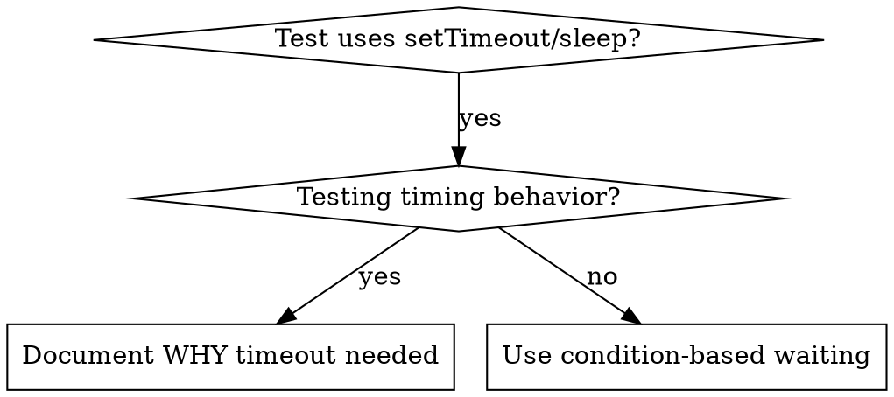

# Condition-Based Waiting（基于条件的等待）

## Overview（概述）

flaky 测试常用任意延迟猜时序。这制造竞态——快机器上过、负载下或 CI 里挂。

**核心原则：** 等你真正关心的**条件**，不是猜它要多久。

## 何时使用



**适用：**
- 测试含任意延迟（`setTimeout`、`sleep`、`time.sleep()`）
- 测试 flaky（有时过，负载下挂）
- 并行跑时超时
- 等异步操作完成

**不适用：**
- 测的就是时序行为（debounce、节流间隔）
- 确需任意超时时，必须注明 WHY

## 核心模式

```typescript
// ❌ BEFORE: Guessing at timing
await new Promise(r => setTimeout(r, 50));
const result = getResult();
expect(result).toBeDefined();

// ✅ AFTER: Waiting for condition
await waitFor(() => getResult() !== undefined);
const result = getResult();
expect(result).toBeDefined();
```

## 速查模式

| 场景 | 模式 |
|----------|---------|
| 等事件 | `waitFor(() => events.find(e => e.type === 'DONE'))` |
| 等状态 | `waitFor(() => machine.state === 'ready')` |
| 等数量 | `waitFor(() => items.length >= 5)` |
| 等文件 | `waitFor(() => fs.existsSync(path))` |
| 复合条件 | `waitFor(() => obj.ready && obj.value > 10)` |

## 实现

通用轮询函数：
```typescript
async function waitFor<T>(
  condition: () => T | undefined | null | false,
  description: string,
  timeoutMs = 5000
): Promise<T> {
  const startTime = Date.now();

  while (true) {
    const result = condition();
    if (result) return result;

    if (Date.now() - startTime > timeoutMs) {
      throw new Error(`Timeout waiting for ${description} after ${timeoutMs}ms`);
    }

    await new Promise(r => setTimeout(r, 10)); // Poll every 10ms
  }
}
```

完整实现（含真实调试会话产出的领域 helper：`waitForEvent`、`waitForEventCount`、`waitForEventMatch`）见本目录 `condition-based-waiting-example.ts`。

## 常见错误

**❌ 轮询太快：** `setTimeout(check, 1)` —— 浪费 CPU
**✅ 修复：** 每 10ms 轮询

**❌ 无超时：** 条件永不满足则死循环
**✅ 修复：** 永远带超时 + 清晰报错

**❌ 数据过期：** 循环前缓存状态
**✅ 修复：** 循环内调 getter 取新数据

## 任意超时何时才对

```typescript
// Tool ticks every 100ms - need 2 ticks to verify partial output
await waitForEvent(manager, 'TOOL_STARTED'); // First: wait for condition
await new Promise(r => setTimeout(r, 200));   // Then: wait for timed behavior
// 200ms = 2 ticks at 100ms intervals - documented and justified
```

**要求：**
1. 先等触发条件
2. 基于已知时序（不是猜）
3. 注释解释 WHY

## 真实成效

来自调试会话（2025-10-03）：
- 修复 3 个文件共 15 个 flaky 测试
- 通过率：60% → 100%
- 执行时间：快 40%
- 竞态清零
