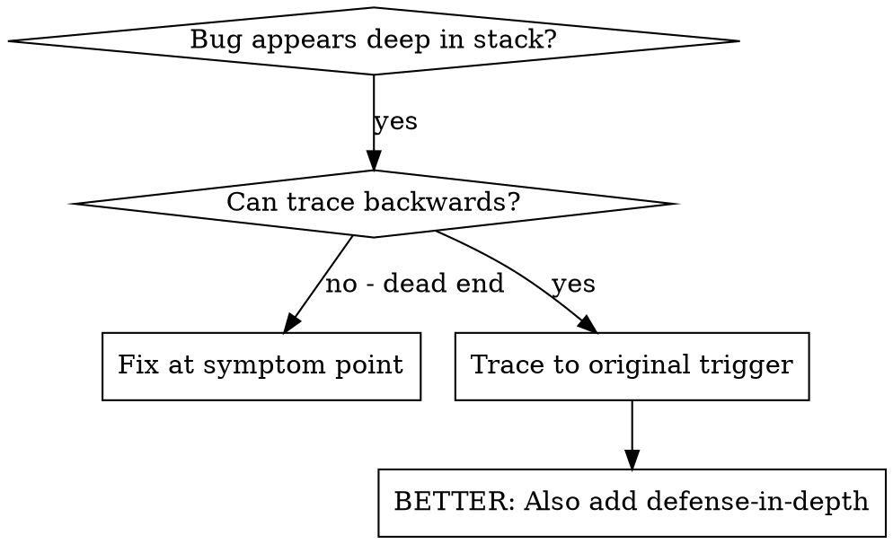
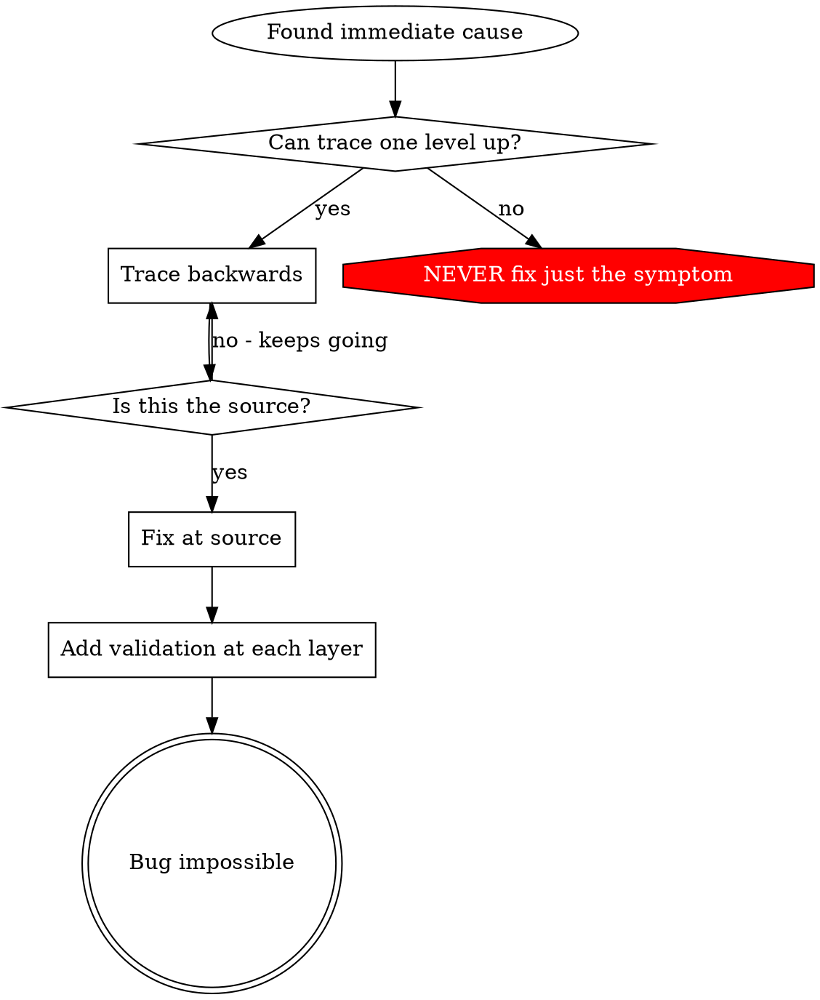

# Root Cause Tracing（根因回溯）

## Overview（概述）

bug 常在调用栈深处显形（git init 进错目录、文件建错位置、数据库打开错路径）。你的直觉是在报错处修，但那是治症状。

**核心原则：** 沿调用链向后回溯，直到找到最初触发点，然后在源头修。

## 何时使用



**适用：**
- 错误发生在执行深处（不在入口）
- stack trace 显示长调用链
- 不清楚坏数据从哪来
- 需要找出哪个测试/代码触发问题

## 回溯流程

### 1. 观察症状
```
Error: git init failed in ~/project/packages/core
```

### 2. 找直接原因
**什么代码直接导致它？**
```typescript
await execFileAsync('git', ['init'], { cwd: projectDir });
```

### 3. 追问：谁调了它？
```typescript
WorktreeManager.createSessionWorktree(projectDir, sessionId)
  → called by Session.initializeWorkspace()
  → called by Session.create()
  → called by test at Project.create()
```

### 4. 继续向上追
**传进来的是什么值？**
- `projectDir = ''`（空字符串！）
- 空字符串作 `cwd` 会解析为 `process.cwd()`
- 那就是源代码目录！

### 5. 找到最初触发点
**空字符串从哪来？**
```typescript
const context = setupCoreTest(); // Returns { tempDir: '' }
Project.create('name', context.tempDir); // Accessed before beforeEach!
```

## 加 stack trace

无法手动回溯时，加埋点：

```typescript
// Before the problematic operation
async function gitInit(directory: string) {
  const stack = new Error().stack;
  console.error('DEBUG git init:', {
    directory,
    cwd: process.cwd(),
    nodeEnv: process.env.NODE_ENV,
    stack,
  });

  await execFileAsync('git', ['init'], { cwd: directory });
}
```

**关键：** 测试里用 `console.error()`（不用 logger——可能不显示）

**运行并捕获：**
```bash
npm test 2>&1 | grep 'DEBUG git init'
```

**分析 stack trace：**
- 找测试文件名
- 定位触发调用的行号
- 识别模式（同一测试？同一参数？）

## 找出哪个测试造成污染

测试期间出现东西但不知道哪个测试时：

用本目录的二分脚本 `find-polluter.sh`：

```bash
./find-polluter.sh '.git' 'src/**/*.test.ts'
```

逐个跑测试，停在第一个污染者。用法见脚本内注释。

## 真实案例：空的 projectDir

**症状：** `.git` 被建在 `packages/core/`（源代码目录）

**回溯链：**
1. `git init` 跑在 `process.cwd()` ← 空的 cwd 参数
2. WorktreeManager 收到空 projectDir
3. Session.create() 传了空字符串
4. 测试在 beforeEach 之前访问了 `context.tempDir`
5. setupCoreTest() 初始返回 `{ tempDir: '' }`

**根因：** 顶层变量初始化访问了空值

**修复：** 把 tempDir 改为 getter，beforeEach 前访问即抛错

**同时加了纵深防御：**
- 层 1：Project.create() 校验目录
- 层 2：WorkspaceManager 校验非空
- 层 3：NODE_ENV 守卫拒绝在 tmpdir 外 git init
- 层 4：git init 前 stack trace 日志

## 关键原则



**绝不只在报错处修。** 回溯到最初触发点。

## Stack Trace 技巧

**测试中：** 用 `console.error()` 不用 logger——logger 可能被抑制
**操作前：** 在危险操作之前记日志，不是失败之后
**带上下文：** 目录、cwd、环境变量、时间戳
**捕获栈：** `new Error().stack` 显示完整调用链

## 真实成效

来自调试会话（2025-10-03）：
- 经 5 级回溯找到根因
- 在源头修复（getter 校验）
- 加了 4 层防御
- 1847 个测试通过，零污染
