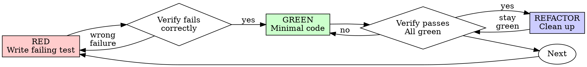

# Test-Driven Development（TDD · 完整方法论）

## Overview（概述）

先写测试。看它失败。写最小代码让它通过。

**核心原则：** 没看过测试失败，你就不知道它测的是不是对的东西。

**违反规则的字面即违反规则的精神。**

## 何时使用

**永远：**
- 新功能
- Bug 修复
- 重构
- 行为变更

**例外（问 human partner）：**
- 一次性原型
- 生成的代码
- 配置文件

在想"就这次跳过 TDD"？停下。那是合理化。

## The Iron Law

```
NO PRODUCTION CODE WITHOUT A FAILING TEST FIRST
```

先写代码后写测试？删掉，重来。

**无例外：**
- 不留作"参考"
- 不边写测试边"适配"它
- 不看它
- 删除就是删除

从测试出发重新实现。就这样。

## Red-Green-Refactor



### RED —— 写失败测试

写一个最小测试，展示应该发生什么。

<Good>
```typescript
test('retries failed operations 3 times', async () => {
  let attempts = 0;
  const operation = () => {
    attempts++;
    if (attempts < 3) throw new Error('fail');
    return 'success';
  };

  const result = await retryOperation(operation);

  expect(result).toBe('success');
  expect(attempts).toBe(3);
});
```
名字清晰、测真实行为、只测一件事
</Good>

<Bad>
```typescript
test('retry works', async () => {
  const mock = jest.fn()
    .mockRejectedValueOnce(new Error())
    .mockRejectedValueOnce(new Error())
    .mockResolvedValueOnce('success');
  await retryOperation(mock);
  expect(mock).toHaveBeenCalledTimes(3);
});
```
名字含糊、测的是 mock 不是代码
</Bad>

**要求：**
- 一个行为
- 清晰的名字
- 真实代码（非不得已不用 mock）

### 验证 RED —— 看它失败

**强制。绝不跳过。**

```bash
npm test path/to/test.test.ts
```

确认：
- 测试失败（不是报错）
- 失败信息符合预期
- 因功能缺失而失败（不是拼写错误）

**测试直接过了？** 你在测既有行为。修测试。

**测试报错？** 修错误，重跑到正确失败。

### GREEN —— 最小代码

写让测试通过的最简代码。

<Good>
```typescript
async function retryOperation<T>(fn: () => Promise<T>): Promise<T> {
  for (let i = 0; i < 3; i++) {
    try {
      return await fn();
    } catch (e) {
      if (i === 2) throw e;
    }
  }
  throw new Error('unreachable');
}
```
恰好够通过
</Good>

<Bad>
```typescript
async function retryOperation<T>(
  fn: () => Promise<T>,
  options?: {
    maxRetries?: number;
    backoff?: 'linear' | 'exponential';
    onRetry?: (attempt: number) => void;
  }
): Promise<T> {
  // YAGNI
}
```
过度设计
</Bad>

不加功能、不重构别的代码、不"改进"超出测试的范围。

### 验证 GREEN —— 看它通过

**强制。**

```bash
npm test path/to/test.test.ts
```

确认：
- 测试通过
- 其他测试仍通过
- 输出干净（无错误、无警告）

**测试失败？** 修代码，不是修测试。

**其他测试挂了？** 现在就修。

### REFACTOR —— 清理

只在绿灯后：
- 消除重复
- 改进命名
- 提取 helper

保持测试绿。不加行为。

### 重复

下一个功能的下一个失败测试。

## 好测试

| 质量 | 好 | 坏 |
|---------|------|-----|
| **最小** | 一件事。名字里有 "and"？拆分。 | `test('validates email and domain and whitespace')` |
| **清晰** | 名字描述行为 | `test('test1')` |
| **显意图** | 展示期望的 API | 掩盖代码该做什么 |

## 为什么顺序重要

**"我写完代码再补测试验证它"**

代码后写的测试立即通过。立即通过证明不了任何事：
- 可能测错了东西
- 可能测的是实现而非行为
- 可能漏掉你忘掉的边界
- 你从没见它抓到过 bug

测试先行逼你看测试失败，证明它真的在测东西。

**"我已经手动测过所有边界"**

手动测试是随机的。你以为测全了，但：
- 没有测过什么的记录
- 代码变了不能重跑
- 压力下容易漏情况
- "我试的时候是好的" ≠ 全面

自动化测试是系统化的。每次同样方式运行。

**"删掉 X 小时的工作太浪费"**

沉没成本谬误。时间已经没了。你现在的选择：
- 删掉用 TDD 重写（再花 X 小时，高置信）
- 留着事后补测试（30 分钟，低置信，大概率有 bug）

真正的"浪费"是留着你无法信任的代码。没有真测试的可运行代码就是技术债。

**"TDD 太教条，务实意味着灵活变通"**

TDD 就是务实的：
- commit 前抓 bug（比事后调试快）
- 防回归（测试立即抓到破坏）
- 记录行为（测试展示代码怎么用）
- 支撑重构（放心改，测试抓破坏）

"务实"的捷径 = 在生产里调试 = 更慢。

**"事后测试达到同样目的——重要的是精神不是仪式"**

不。事后测试回答"这是干什么的？"测试先行回答"这应该干什么？"

事后测试被你的实现带偏。你测你建了的，不是要求的。你验证记得的边界，不是发现的边界。

测试先行逼你在实现前发现边界。事后测试验证你记全了（你没有）。

30 分钟的事后测试 ≠ TDD。你得到覆盖率，失去"测试有效"的证明。

## 常见合理化借口

| 借口 | 现实 |
|--------|---------|
| "太简单不用测" | 简单代码也会坏。测试只要 30 秒。 |
| "我事后测" | 立即通过的测试证明不了任何事。 |
| "事后测试达到同样目的" | 事后 = "这是干什么的？"先行 = "这应该干什么？" |
| "已经手动测过" | 随机 ≠ 系统。无记录、不能重跑。 |
| "删掉 X 小时太浪费" | 沉没成本谬误。留未验证代码才是技术债。 |
| "留作参考，先写测试" | 你会顺手改它。那就是事后测试。删除就是删除。 |
| "需要先探索" | 可以。探索完扔掉，从 TDD 开始。 |
| "测试难写 = 设计不清" | 听测试的。难测 = 难用。 |
| "TDD 拖慢我" | TDD 比调试快。务实 = 测试先行。 |
| "手动测更快" | 手动证明不了边界。每次改动都得重测。 |
| "存量代码没测试" | 你正在改进它。给存量代码补测试。 |

## Red Flags —— 停下，重来

- 先代码后测试
- 实现后补测试
- 测试立即通过
- 说不出测试为什么失败
- 测试"以后再加"
- 合理化"就这一次"
- "我已经手动测过了"
- "事后测试达到同样目的"
- "重要的是精神不是仪式"
- "留作参考"或"适配既有代码"
- "已经花了 X 小时，删了浪费"
- "TDD 太教条，我这是务实"
- "这次不一样，因为……"

**以上任何一条 = 删代码，用 TDD 重来。**

## 示例：Bug 修复

**Bug：** 空邮箱被接受

**RED**
```typescript
test('rejects empty email', async () => {
  const result = await submitForm({ email: '' });
  expect(result.error).toBe('Email required');
});
```

**验证 RED**
```bash
$ npm test
FAIL: expected 'Email required', got undefined
```

**GREEN**
```typescript
function submitForm(data: FormData) {
  if (!data.email?.trim()) {
    return { error: 'Email required' };
  }
  // ...
}
```

**验证 GREEN**
```bash
$ npm test
PASS
```

**REFACTOR**
需要的话为多字段提取校验。

## 验证清单

标记工作完成之前：

- [ ] 每个新函数/方法有测试
- [ ] 实现前看过每个测试失败
- [ ] 每个测试因预期原因失败（功能缺失，非笔误）
- [ ] 为每个测试写了最小通过代码
- [ ] 全部测试通过
- [ ] 输出干净（无错误、无警告）
- [ ] 测试用真实代码（非不得已不用 mock）
- [ ] 边界与错误已覆盖

不能全勾？你跳过了 TDD。重来。

## 卡住时

| 问题 | 解法 |
|---------|----------|
| 不知道怎么测 | 写出你期望的 API。先写断言。问 human partner。 |
| 测试太复杂 | 设计太复杂。简化接口。 |
| 必须 mock 一切 | 代码耦合太重。用依赖注入。 |
| 测试 setup 巨大 | 提取 helper。还复杂？简化设计。 |

## 调试集成

发现 bug？写复现它的失败测试。走 TDD 循环。测试证明修复并防回归。

绝不无测试修 bug。

## 测试反模式

加 mock 或测试工具时，读 @testing-anti-patterns.md 避免常见坑：
- 测 mock 行为而非真实行为
- 给生产类加测试专用方法
- 不理解依赖就 mock

## 最终规则

```
Production code → test exists and failed first
Otherwise → not TDD
```

无 human partner 许可，无例外。
