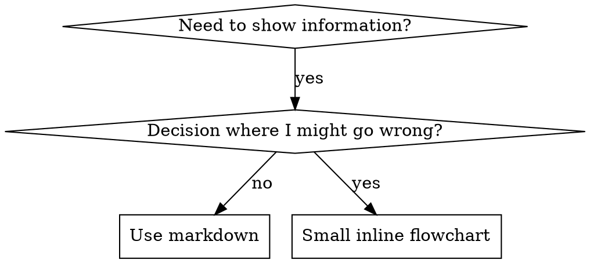

# Skill 详细规范（lazy-load 参考）

> 本文档从 `SKILL.md` 拆出（v2.0 system-review · 658→≤500 行硬规则）。
> 主干 SKILL.md 保留入口 + 流程 + 关键检查清单；本文承载可 lazy load 的详细规范段（格式 / 长度 / 字数 / 具体写法 / 测试方法 / 反模式）。
> 按需阅读，不必整篇加载。

---

## SKILL.md 结构模板

**Frontmatter（YAML）：**
- 两个必填字段：`name` 和 `description`（所有支持字段见 [agentskills.io/specification](https://agentskills.io/specification)）
- 总计最多 1024 字符
- `name`：只用字母、数字、连字符（不要括号、特殊字符）
- `description`：第三人称，只描述何时用（**不**描述做什么）
  - 以 "Use when..." 开头聚焦触发条件
  - 包含具体症状、场景、上下文
  - **绝不**概述 skill 的流程或工作流（原因见 CSO 段）
  - 尽量控制在 500 字符以内

```markdown
---
name: Skill-Name-With-Hyphens
description: Use when [具体触发条件和症状]
---

# Skill Name

## Overview
这是什么？核心原则 1-2 句。

## When to Use
[若决策不明显 · 放小型 inline flowchart]

带 SYMPTOMS 和用例的列表
何时不用

## Core Pattern（technique/pattern 用）
Before/after 代码对比

## Quick Reference
表格或 bullets · 快速扫读常用操作

## Implementation
简单模式用 inline 代码
重 reference 或可复用工具用链接

## Common Mistakes
易错点 + 修复

## Real-World Impact（可选）
具体收益
```

---

## Claude Search Optimization（CSO）

**发现性关键：** 未来的 Claude 需要能找到你的 skill。

### 1. Rich Description Field

**目的：** Claude 读 description 来决定为某个任务加载哪个 skill。让它回答："我现在该读这个 skill 吗？"

**格式：** 以 "Use when..." 开头聚焦触发条件。

**关键：Description = When to Use，不是 What the Skill Does。**

description 应只描述触发条件。**不**要在 description 里概述 skill 的流程或工作流。

**为什么重要：** 测试表明，当 description 概述了 skill 的工作流，Claude 可能会跟着 description 走，而不是读完整 skill 内容。一个说"任务间做 code review"的 description 曾导致 Claude 只做一次 review，即便 skill 的 flowchart 明确画了两道 review（先 spec 合规，再代码质量）。

当 description 改为只说 "Use when executing implementation plans with independent tasks"（无工作流摘要）时，Claude 正确读取了 flowchart 并遵循了两阶段 review 流程。

**陷阱：** 概述工作流的 description 会形成 Claude 走的捷径。skill 主体变成了 Claude 跳过的文档。

```yaml
# ❌ BAD: 概述工作流 — Claude 可能跟着走，不读 skill
description: Use when executing plans - dispatches subagent per task with code review between tasks

# ❌ BAD: 过多流程细节
description: Use for TDD - write test first, watch it fail, write minimal code, refactor

# ✅ GOOD: 只给触发条件，无工作流摘要
description: Use when executing implementation plans with independent tasks in the current session

# ✅ GOOD: 只给触发条件
description: Use when implementing any feature or bugfix, before writing implementation code
```

**内容：**
- 用具体触发器、症状、场景来标示 skill 适用
- 描述*问题*（race conditions、不一致行为）而非*语言特定症状*（setTimeout、sleep）
- 触发器保持技术无关，除非 skill 本身就是技术特定的
- 若 skill 技术特定，在触发器里明确
- 第三人称（注入 system prompt）
- **绝不**概述 skill 的流程或工作流

```yaml
# ❌ BAD: 太抽象、模糊、不含何时用
description: For async testing

# ❌ BAD: 第一人称
description: I can help you with async tests when they're flaky

# ❌ BAD: 提到技术但 skill 并不专于此
description: Use when tests use setTimeout/sleep and are flaky

# ✅ GOOD: 以 "Use when" 开头，描述问题，无工作流
description: Use when tests have race conditions, timing dependencies, or pass/fail inconsistently

# ✅ GOOD: 技术特定 skill 带明确触发器
description: Use when using React Router and handling authentication redirects
```

### 2. Keyword Coverage

用 Claude 会搜索的词：
- 错误消息："Hook timed out"、"ENOTEMPTY"、"race condition"
- 症状："flaky"、"hanging"、"zombie"、"pollution"
- 同义词："timeout/hang/freeze"、"cleanup/teardown/afterEach"
- 工具：实际命令、库名、文件类型

### 3. Descriptive Naming

**用主动语态、动词在前：**
- ✅ `creating-skills` 不是 `skill-creation`
- ✅ `condition-based-waiting` 不是 `async-test-helpers`

**按你做什么或核心洞见命名：**
- ✅ `condition-based-waiting` > `async-test-helpers`
- ✅ `using-skills` 不是 `skill-usage`
- ✅ `flatten-with-flags` > `data-structure-refactoring`
- ✅ `root-cause-tracing` > `debugging-techniques`

**动名词（-ing）适合流程：**
- `creating-skills`、`testing-skills`、`debugging-with-logs`
- 主动，描述你正在做的动作

### 4. Token Efficiency（关键）

**问题：** getting-started 和高频加载 skill 会被注入每个对话。每个 token 都算数。

**目标字数：**
- getting-started workflows：每篇 <150 词
- 高频加载 skill：总计 <200 词
- 其他 skill：<500 词（仍要简洁）

**技巧：**

**把细节挪到 tool help：**
```bash
# ❌ BAD: 在 SKILL.md 列所有 flag
search-conversations supports --text, --both, --after DATE, --before DATE, --limit N

# ✅ GOOD: 引用 --help
search-conversations supports multiple modes and filters. Run --help for details.
```

**用交叉引用：**
```markdown
# ❌ BAD: 重复工作流细节
When searching, dispatch subagent with template...
[20 lines of repeated instructions]

# ✅ GOOD: 引用别的 skill
Always use subagents (50-100x context savings). REQUIRED: Use [other-skill-name] for workflow.
```

**压缩示例：**
```markdown
# ❌ BAD: 啰嗦示例（42 词）
your human partner: "How did we handle authentication errors in React Router before?"
You: I'll search past conversations for React Router authentication patterns.
[Dispatch subagent with search query: "React Router authentication error handling 401"]

# ✅ GOOD: 最小示例（20 词）
Partner: "How did we handle auth errors in React Router?"
You: Searching...
[Dispatch subagent → synthesis]
```

**消除冗余：**
- 不重复交叉引用 skill 里已有的内容
- 不解释命令已说清的事
- 同一模式不放多个示例

**验证：**
```bash
wc -w skills/path/SKILL.md
# getting-started workflows: 目标 <150 每篇
# 其他高频: 目标 <200 总计
```

### 5. Cross-Referencing Other Skills

**写引用其他 skill 的文档时：**

只用 skill 名，带明确的必要标记：
- ✅ Good: `**REQUIRED SUB-SKILL:** Use superpowers:test-driven-development`
- ✅ Good: `**REQUIRED BACKGROUND:** You MUST understand superpowers:systematic-debugging`
- ❌ Bad: `See skills/testing/test-driven-development`（不清楚是否必要）
- ❌ Bad: `@skills/testing/test-driven-development/SKILL.md`（强制加载，烧 context）

**为什么不用 @ 链接：** `@` 语法会立即强制加载文件，在你需要前就消耗 200k+ context。

---

## Flowchart Usage



**只在以下场景用 flowchart：**
- 不明显的决策点
- 可能提前停下的流程循环
- "何时用 A vs B" 的决策

**绝不用 flowchart 于：**
- reference 材料 → 用表格、列表
- 代码示例 → 用 markdown 块
- 线性指令 → 用编号列表
- 无语义的标签（step1、helper2）

graphviz 样式规则见 @graphviz-conventions.dot。

**为你的 partner 可视化：** 用本目录的 `render-graphs.js` 把 skill 的 flowchart 渲染成 SVG：
```bash
./render-graphs.js ../some-skill           # 每张图单独
./render-graphs.js ../some-skill --combine # 所有图合一张 SVG
```

---

## Code Examples

**一个优秀示例胜过一堆平庸示例。**

选最相关语言：
- 测试技巧 → TypeScript/JavaScript
- 系统调试 → Shell/Python
- 数据处理 → Python

**好示例：**
- 完整且可运行
- 注释解释 WHY
- 来自真实场景
- 清晰展示模式
- 可直接改造（非通用模板）

**不要：**
- 用 5+ 语言实现
- 造填空模板
- 写人为捏造的示例

你擅长移植 — 一个好示例就够了。

---

## File Organization

### Self-Contained Skill
```
defense-in-depth/
  SKILL.md    # 全部 inline
```
When: 内容都装得下，无重 reference

### Skill with Reusable Tool
```
condition-based-waiting/
  SKILL.md    # Overview + patterns
  example.ts  # 可改造的工作 helper
```
When: 工具是可复用代码，不只是叙述

### Skill with Heavy Reference
```
pptx/
  SKILL.md       # Overview + workflows
  pptxgenjs.md   # 600 行 API reference
  ooxml.md       # 500 行 XML 结构
  scripts/       # 可执行工具
```
When: reference 材料太大，不适合 inline

---

## The Iron Law（同 TDD）

```
NO SKILL WITHOUT A FAILING TEST FIRST
```

这适用于**新 skill** 也适用于**对现有 skill 的编辑**。

先写 skill 再测试？删掉。重来。
不测试就改 skill？同样违规。

**无例外：**
- 不为"简单新增"
- 不为"只是加一节"
- 不为"文档更新"
- 不要把未测试改动留作"参考"
- 不要"边测边改"
- 删除即删除

**REQUIRED BACKGROUND:** superpowers:test-driven-development skill 解释了为什么这很重要。同样原则适用于文档。

---

## Testing All Skill Types

不同 skill 类型需要不同测试方法：

### Discipline-Enforcing Skills（规则/要求）

**例子：** TDD、verification-before-completion、designing-before-coding

**测什么：**
- 学术问题：他们懂规则吗？
- 压力场景：压力下还守规则吗？
- 多重压力叠加：时间 + 沉没成本 + 疲惫
- 识别合理化借口并加显式反制

**成功标准：** 最大压力下 agent 仍守规则

### Technique Skills（how-to 指南）

**例子：** condition-based-waiting、root-cause-tracing、defensive programming

**测什么：**
- 应用场景：能正确应用技巧吗？
- 变体场景：处理边界吗？
- 信息缺失测试：指令有空白吗？

**成功标准：** agent 成功把技巧用到新场景

### Pattern Skills（心智模型）

**例子：** reducing-complexity、information-hiding 概念

**测什么：**
- 识别场景：能识别模式适用吗？
- 应用场景：用心智模型吗？
- 反例：知道何时不该用吗？

**成功标准：** agent 正确识别何时/如何应用模式

### Reference Skills（文档/API）

**例子：** API 文档、命令 reference、库指南

**测什么：**
- 检索场景：能找到对的信息吗？
- 应用场景：能用找到的内容吗？
- 空白测试：常见用例覆盖吗？

**成功标准：** agent 找到并正确应用 reference 信息

---

## Common Rationalizations for Skipping Testing

| 借口 | 现实 |
|--------|---------|
| "Skill 很清楚" | 你觉得清楚 ≠ 其他 agent 清楚。测。 |
| "只是个 reference" | reference 也会有空白、不清晰的段。测检索。 |
| "测试过头了" | 未测的 skill 一定有问题。15 分钟测试省几小时。 |
| "出问题再测" | 问题 = agent 用不了 skill。部署前测。 |
| "太烦了" | 测试比线上 debug 坏 skill 省事。 |
| "我有信心" | 过度自信必出问题。照样测。 |
| "学术审查够了" | 读 ≠ 用。测应用场景。 |
| "没时间测" | 部署未测 skill 之后修更费时。 |

**以上全部意味着：部署前测。无例外。**

---

## Bulletproofing Skills Against Rationalization

执行纪律的 skill（如 TDD）需要抗合理化。agent 很聪明，压力下会找漏洞。

**心理学注记：** 理解说服技巧为什么奏效，有助于系统化应用。研究基础（Cialdini, 2021; Meincke et al., 2025）见 persuasion-principles.md，涵盖权威、承诺、稀缺、社会认同、归属感原则。

### Close Every Loophole Explicitly

不只陈述规则 — 显式禁止具体规避：

<Bad>
```markdown
Write code before test? Delete it.
```
</Bad>

<Good>
```markdown
Write code before test? Delete it. Start over.

**No exceptions:**
- Don't keep it as "reference"
- Don't "adapt" it while writing tests
- Don't look at it
- Delete means delete
```
</Good>

### Address "Spirit vs Letter" Arguments

早期加基础原则：

```markdown
**Violating the letter of the rules is violating the spirit of the rules.**
```

这切掉整类"我在守精神"的合理化。

### Build Rationalization Table

从基线测试捕获合理化借口（见 Testing 段）。agent 找的每个借口都进表：

```markdown
| Excuse | Reality |
|--------|---------|
| "Too simple to test" | Simple code breaks. Test takes 30 seconds. |
| "I'll test after" | Tests passing immediately prove nothing. |
| "Tests after achieve same goals" | Tests-after = "what does this do?" Tests-first = "what should this do?" |
```

### Create Red Flags List

让 agent 在合理化时容易自检：

```markdown
## Red Flags - STOP and Start Over

- Code before test
- "I already manually tested it"
- "Tests after achieve the same purpose"
- "It's about spirit not ritual"
- "This is different because..."

**All of these mean: Delete code. Start over with TDD.**
```

### Update CSO for Violation Symptoms

在 description 里加：你即将违规时的症状：

```yaml
description: use when implementing any feature or bugfix, before writing implementation code
```

---

## RED-GREEN-REFACTOR for Skills

遵循 TDD 循环：

### RED: Write Failing Test（Baseline）

无 skill 跑压力场景。记录确切行为：
- 他们做了什么选择？
- 用了什么合理化借口（逐字）？
- 哪些压力触发了违规？

这就是"看测试失败" — 写 skill 前必须先看 agent 自然会做什么。

### GREEN: Write Minimal Skill

写针对那些具体合理化的 skill。不加针对假设情况的内容。

同一场景**有** skill 再跑。agent 现在应守规则。

### REFACTOR: Close Loopholes

agent 找到新合理化？加显式反制。重测直到无懈可击。

**测试方法：** 完整测试方法见 @testing-skills-with-subagents.md：
- 如何写压力场景
- 压力类型（时间、沉没成本、权威、疲惫）
- 系统性堵漏洞
- 元测试技巧

---

## Anti-Patterns

### ❌ Narrative Example
"In session 2025-10-03, we found empty projectDir caused..."
**Why bad:** 太具体，不可复用

### ❌ Multi-Language Dilution
example-js.js, example-py.py, example-go.go
**Why bad:** 质量平庸，维护负担重

### ❌ Code in Flowcharts
```dot
step1 [label="import fs"];
step2 [label="read file"];
```
**Why bad:** 不能复制粘贴，难读

### ❌ Generic Labels
helper1, helper2, step3, pattern4
**Why bad:** 标签应有语义

---

## STOP: Before Moving to Next Skill

**写完任一 skill 后，必须停下完成部署流程。**

**不要：**
- 不测就批量创建多个 skill
- 当前 skill 未验证就做下一个
- 因为"批量更高效"跳过测试

**下面的部署清单对每个 skill 都是强制的。**

部署未测 skill = 部署未测代码。违反质量标准。

---

## Discovery Workflow

未来 Claude 如何发现你的 skill：

1. **遇到问题**（"tests are flaky"）
3. **找到 SKILL**（description 匹配）
4. **扫 overview**（相关吗？）
5. **读 patterns**（quick reference 表）
6. **加载示例**（只在实施时）

**为此流程优化** — 把可搜索词放早、放多。
